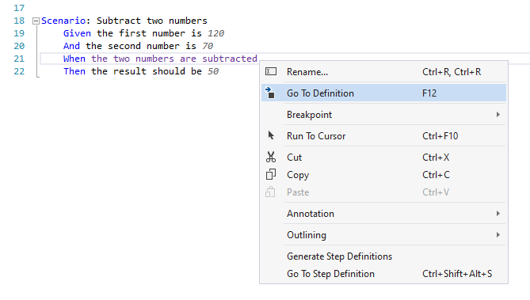
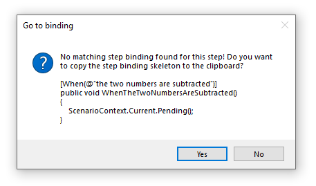

Exercise-Solution
========

⏲️ 10 minutes

In this step you can review the solution for the challenge in the previous step (implementing the subtraction in the calculator).

To recap the 3 steps to implement the new feature:

1. First add the missing bindings (with the minimum code structure necessary) to get a red scenario.
2. Next turn the scenario green by actually implementing the logic.
3. Refactor the implementation if necessary (scenarios should remain green).

The first step is to add the missing binding and necessary code to have a red scenario. A quick way of generating the necessary binding methods is if you right-click the unbound step in the feature file and select "Go To Definition".  


If SpecFlow does not find the corresponding binding method it offers to generate the skeleton of the binding method into your clipboard.  


Now you can easily paste the method into the binding class and change the implementation.

``` c#
    [When(@"the two numbers are subtracted")]
    public void WhenTheTwoNumbersAreSubtracted()
    {
        _result = _calculator.Subtract();
    }
```

To be able to implement the binding in a meaningful way you have to extend the public interface of the calculator as well to support the subtraction. However, in the first step, your only goal is to get to an executable red scenario.
Hence you have to add a `Subtract` method to the calculator, but the implementation should be skipped e.g. by throwing a `NotImplementedException`.
Note that in this case the scenario will fail in the "When" step already due to the exception and the "Then" step will be skipped.

``` c#
using System;

namespace SpecFlowCalculator
{
    public class Calculator
    {
        public int FirstNumber { get; set; }
        public int SecondNumber { get; set; }

        public int Add()
        {
            return FirstNumber + SecondNumber;
        }

        public int Subtract()
        {
            throw new NotImplementedException();
        }
    }
}
```

Alternatively you can return a dummy value (e.g. constant 0). In this case the scenario will also run the "Then" step and fail on the assertion. This is especially beneficial if you've just created the binding of the Then step too and you want to make sure that the binding works as expected.

``` c#
    public int Subtract()
    {
        return 0;
    }
```

If you build the solution and run the tests the scenario should be red and you're ready to move on to the second step.

The second step is to implement the subtraction of the calculator to get the scenario green.

``` c#
        public int Subtract()
        {
            return FirstNumber - SecondNumber;
        }
```

If you run the tests again the scenario should be green.

The third step is to refactor the code while keeping all scenarios green. However, in this case the implementation is so simple that we can skip the refactoring step now.
