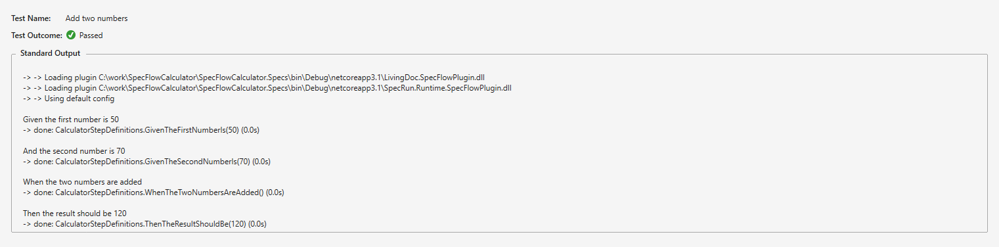

Exercise
=========

⏲️ 15 minutes

In this step it is your turn to implement the subtraction feature of the calculator.

**1-** Add the following scenario to the `Calculator.feature` file.

``` Gherkin
Scenario: Subtract two numbers
    Given the first number is 120
    And the second number is 70
    When the two numbers are subtracted
    Then the result should be 50
```

**2-** Build the solution. The build should succeed.

**3-** Run the tests. Notice that you have now 2 tests (corresponding to your two scenarios) and the second scenario is "Skipped" because of missing bindings.  


**4-** Click on the "Open additional output for this result" and review the details of the scenario execution.  


Now it is your turn to implement the subtraction feature in three short steps:

1. First add the missing binding (with the minimum code structure necessary) to get a red scenario.
1. Next turn the scenario green by actually implementing the subtraction logic in the calculator.
1. Refactor your implementation if necessary (scenarios should remain green).

Did it work out? 🏆

In the next step you can see a possible solution.
