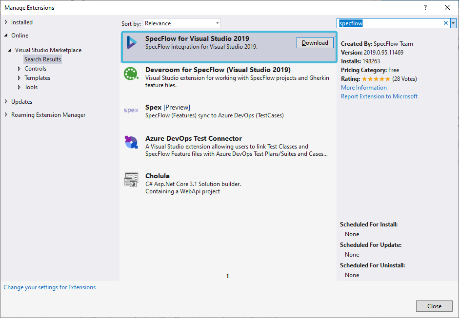
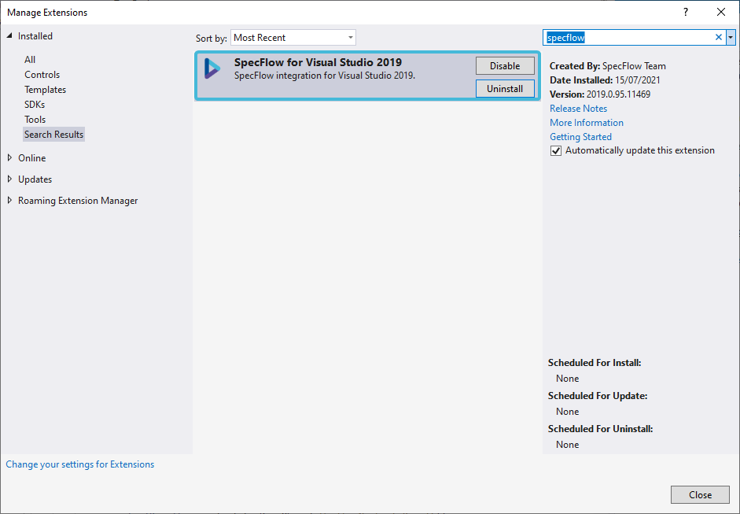

Install Visual Studio Extension
================================

⏲️ 10 minutes

In this step you'll learn how to install the Visual Studio extension for SpecFlow.

Specflow's Visual Studio extension not only enables the functionalities needed for testing automation, but is also bundled with several helpful <a href="https://docs.specflow.org/projects/specflow/en/latest/Tools/Visual-Studio-Integration-Editing-Features.html" target="_blank" rel="noopener noreferrer">features</a> , to make the journey more intuitive.

Specflow's Visual Studio extension works on Visual Studio 2017 & 2019.
If you are using an older version of Visual Studio, please upgrade to the <a href="https://visualstudio.microsoft.com/downloads/" target="_blank" rel="noopener noreferrer">latest version</a>.

Installation of the extension is simple:

**1-** Open Visual Studio. **We use Visual Studio 2019 in this guide*

**2-** Navigate to "Extensions ➡ Manage Extensions ➡ Online " and search for "Specflow" in the search bar.

**3-** Hit ***Download*** to begin the installation. You will need to restart Visual Studio for the installation to complete:  

Once the extension is successfully installed, you can see it in the list of "Installed" extensions in the "Extensions ➡ Manage Extensions" dialog of Visual Studio.

 In the next steps you'll create a simple application that will be used throughout this guide.
