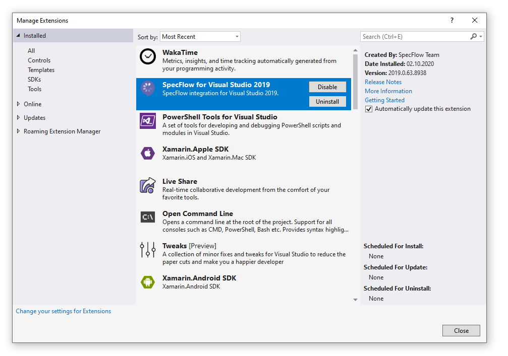

Install Visual Studio Extension
===============================

⏲️ 5 minutes

In this step you'll learn how to install the Visual Studio extension for SpecFlow.

The Visual Studio extension provides several helpful features, such as syntax highlighting for Gherkin (feature) files, a Visual Studio project template, and multiple item templates, which help you create executable specifications with SpecFlow.

Download the extension for your version of Visual Studio:

- [Visual Studio 2019](https://marketplace.visualstudio.com/items?itemName=TechTalkSpecFlowTeam.SpecFlowForVisualStudio)
- [Visual Studio 2017](https://marketplace.visualstudio.com/items?itemName=TechTalkSpecFlowTeam.SpecFlowforVisualStudio2017)

If you use an older version of Visual Studio, you'll have to upgrade to one of the supported versions.

When the extension is successfully installed, you can see it in the list of "Installed" extensions in the "Extensions -> Manage Extensions" dialog of Visual Studio.

Watch these steps:

<iframe width="800" height="450" src="https://www.youtube-nocookie.com/embed/QBQbJwYB4Po" frameborder="0" allow="accelerometer; autoplay; clipboard-write; encrypted-media; gyroscope; picture-in-picture" allowfullscreen></iframe>
