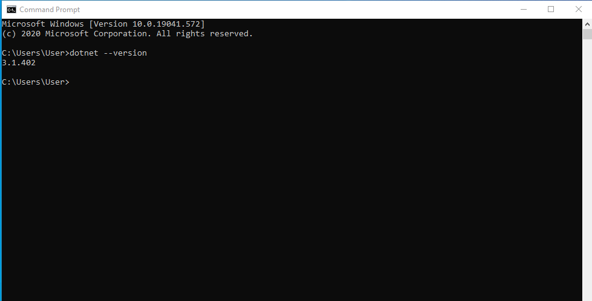
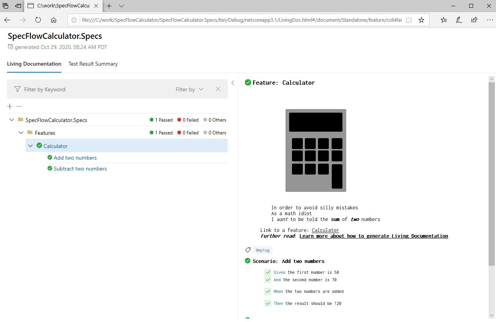
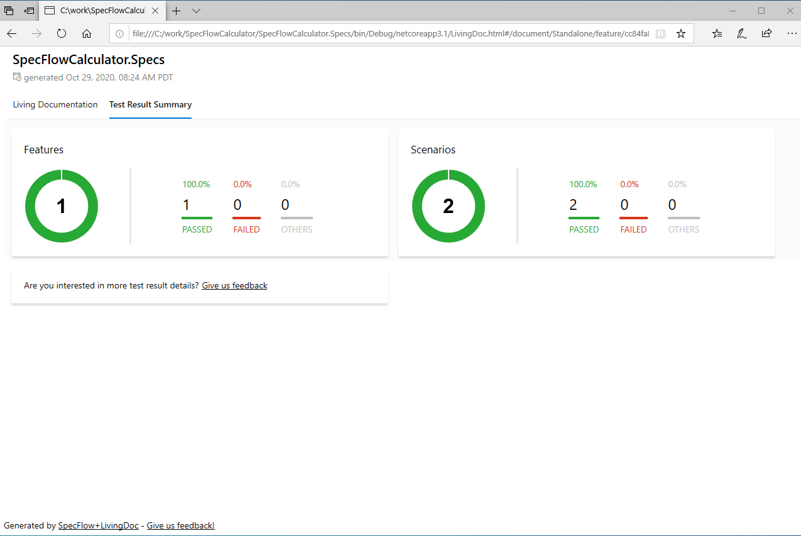

Add Living Documentation
========================

⏲️ 5 minutes

In this step you'll learn how to generate a living documentation from your test execution results.

Open a command prompt.  


Test quickly if you have the .NET CLI installed.

``` batch
dotnet --version`  
```



Install the LivingDoc CLI as a global dotnet tool.

``` batch
dotnet tool install --global SpecFlow.Plus.LivingDoc.CLI
```


Navigate to the output directory of the SpecFlow project. In our case the solution was setup in the `C:\work` folder.

``` batch
cd C:\work\SpecFlowCalculator\SpecFlowCalculator.Specs\bin\Debug\netcoreapp3.1
```

Run the LivingDoc CLI to generate the HTML report.

``` batch
livingdoc FeatureData.json
```


Open the generated HTML with your favorite browser.

``` batch
C:\work\SpecFlowCalculator\SpecFlowCalculator.Specs\bin\Debug\netcoreapp3.1\LivingDoc.html
```

Review the living documentation of the calculator features that you have implemented. Select the "Calculator" feature in the tree. In the right pane check the detailed description of the feature and the scenarios. You can also see the "green" test execution result of the scenarios and steps.  


Check the test result summary. Click on the "Test Result Summary" tab.  

