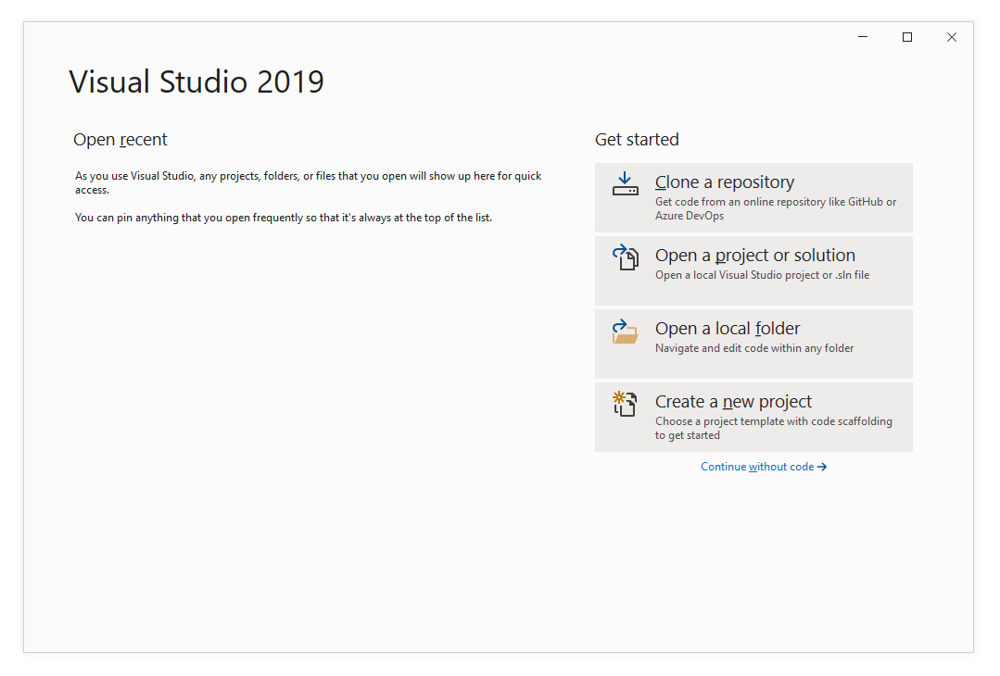
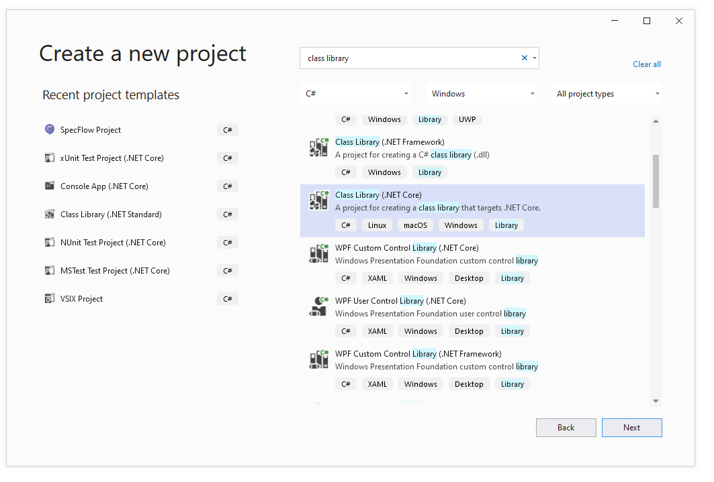
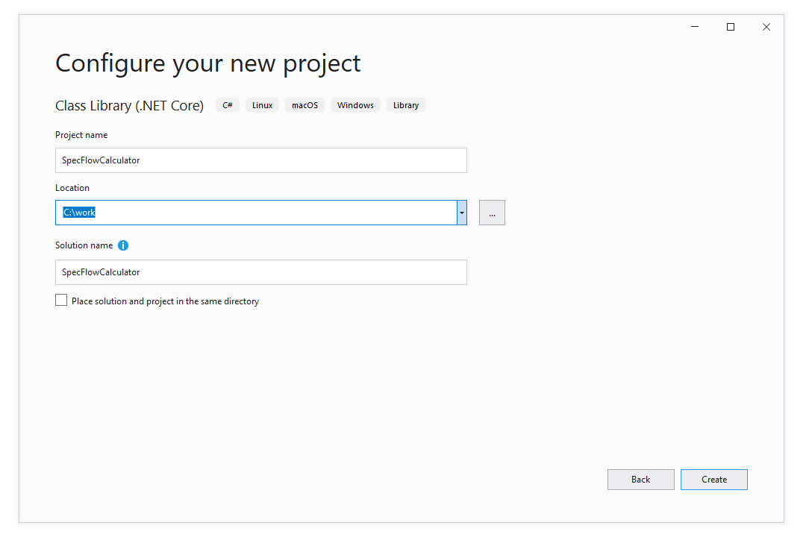
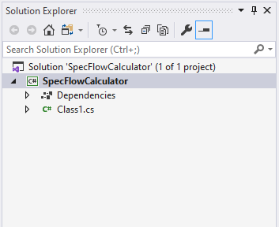

Create Calculator Project
=========================

⏲️ 10 minutes

In this step you'll create the application that will be tested, also called system under test (SUT).
The application will be a simple calculator in a C# class library.

Open Visual Studio and create a new C# class library as follows.

Select "Create a new project" from the Visual Studio startup dialog.  
  

Search for "class library core" and select the "Class Library (.NET Core)" project template and click "Next".  
  

Enter the project name and solution name "SpecFlowCalculator" and choose a location. In our case the solution will be saved to `C:\work`.  
  

Click "Create" and Visual Studio creates the new class library project.  


Rename `Class1.cs` to `Calculator.cs` and overwrite the content with the following code.

``` csharp
using System;

namespace SpecFlowCalculator
{
    public class Calculator
    {
        public int FirstNumber { get; set; }
        public int SecondNumber { get; set; }

        public int Add()
        {
            throw new NotImplementedException();
        }
    }
}

```

Build the solution. The build should succeed.

In the next step you'll learn how to create a SpecFlow project.
