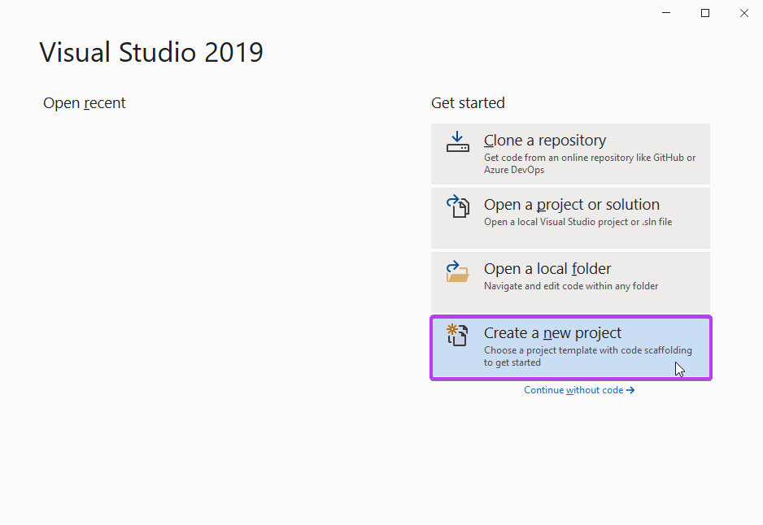
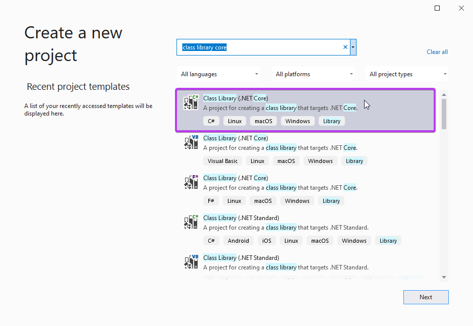
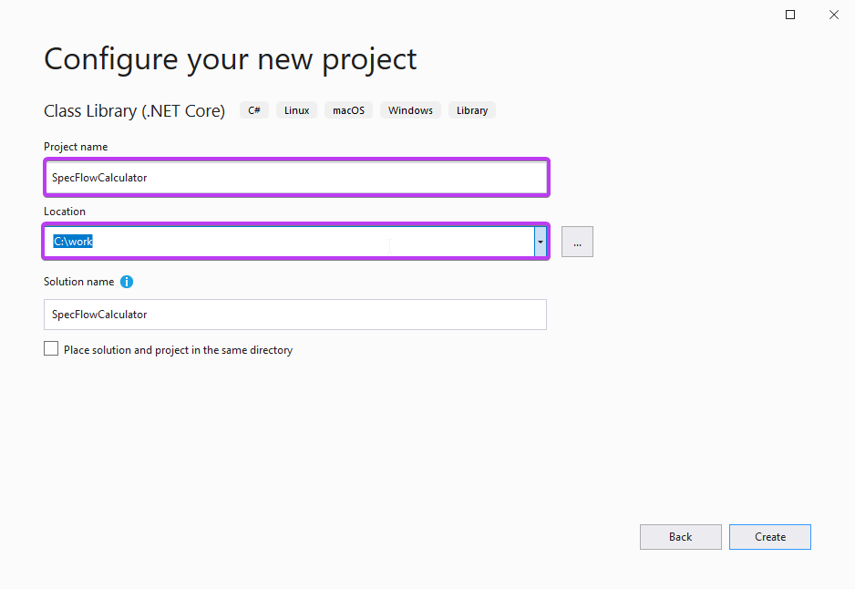
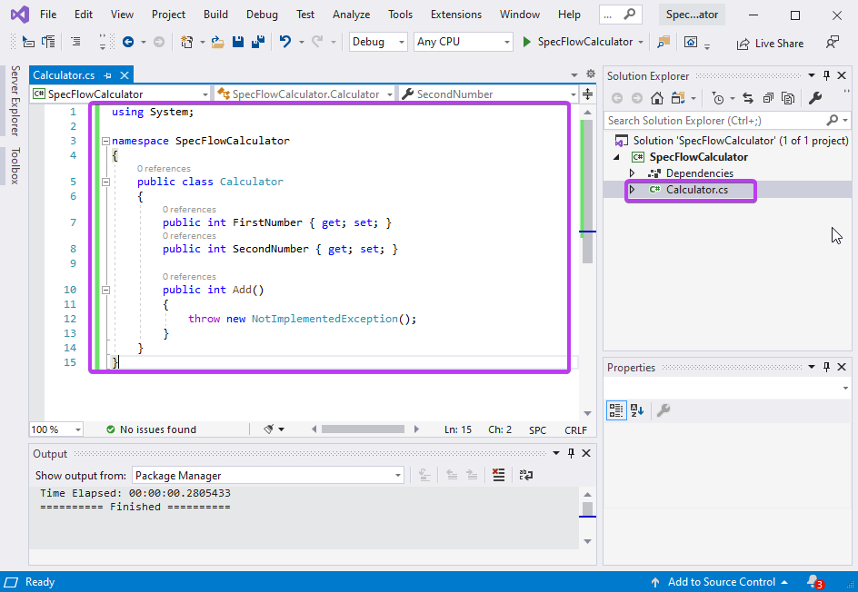
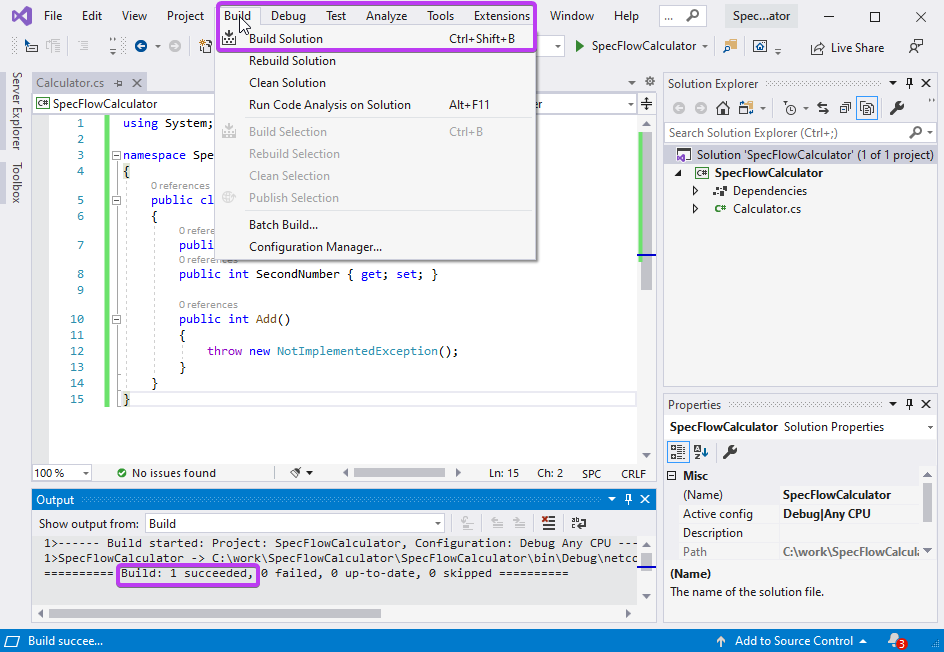

Create Calculator Project
=========================

⏲️ 10 minutes

In this step you'll create the application that will be tested, also called System Under Test (SUT).
The application will be a simple calculator in a C# class library.

<iframe width="560" height="315" src="https://www.youtube.com/embed/4DcOVMFsCI8" frameborder="0" allow="accelerometer; autoplay; clipboard-write; encrypted-media; gyroscope; picture-in-picture" allowfullscreen></iframe>


**1-** Open Visual Studio and create a new C# class library by selecting "Create a new project" from the Visual Studio startup dialog:
  
  

**2-** Search for "Class library core" and select the "C# Class Library (.NET Core)" project template and click ***Next***.  
  

**3-** Enter the project name as "SpecFlowCalculator", choose a location to save the project and hit ***Create***. In this scenario the solution will be saved to `C:\work`.

  

**Solution name automatically updates to project name, leave it as is.*  

**4-** Rename `Class1.cs` to `Calculator.cs` and overwrite the content with the following code :

``` csharp
using System;

namespace SpecFlowCalculator
{
    public class Calculator
    {
        public int FirstNumber { get; set; }
        public int SecondNumber { get; set; }

        public int Add()
        {
            throw new NotImplementedException();
        }
    }
}

```



**5-** Now build the solution by navigating to "Build ➡ Build Solution" You will see a "Build : 1 Succeeded" message in the output window:



 The calculator application is now built. In the next step you'll learn how to create a SpecFlow project.
