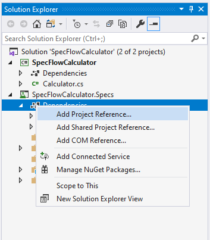
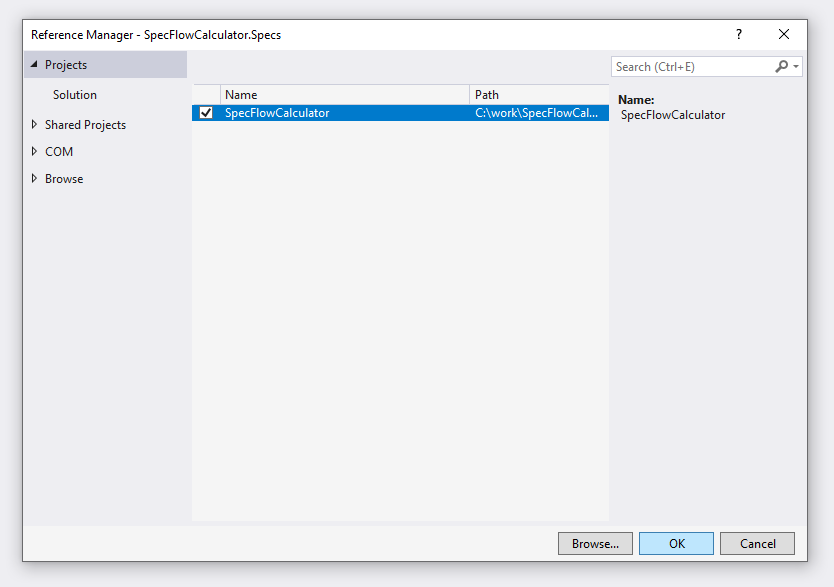

Create SpecFlow Project
=======================

⏲️ 10 minutes

In this step you'll create the SpecFlow project in the solution using Visual Studio.

Right-click the solution item "Solution 'SpecFlowCalculator' (1 of 1 project)" in the Solution Explorer and select the "Add -> New Project..." menu item.  

Search for "SpecFlow", select the "SpecFlow Project" template and click "Next".  
  

Enter the project name "SpecFlowCalculator.Specs". You can keep the suggested location (the solution folder) and click "Create".  
  

On the next screen you can configure some further details for the SpecFlow project, but you can leave everything on default now. Click "Create".  
  

Visual Studio creates the new SpecFlow project and starts to resolve the NuGet packages in the background.
You should see the new SpecFlow project in the Solution Explorer.  

As a next step add a project reference in the newly created SpecFlow project to the "SpecFlowCalculator" class library. This is necessary because we want to test the "Calculator" class implemented in the class library in the "SpecFlowCalculator.Specs" project. Expand the project node "SpecFlowCalculator.Specs" in the Solution Explorer, right-click the "Dependencies" node and select the "Add Project Reference..." menu item.  

In the "Reference Manager" dialog check the "SpecFlowCalculator" class library and click "OK".

Now the solution is set up with a class library containing the implementation of the calculator and a SpecFlow project that will contain the specification and tests of the calculator.

Build the solution. The build should succeed.

Open the test explorer dialog from the menu "Tests -> Test Explorer".  

You should see a test already added to the SpecFlow project by the project template.  

Run the tests using the "Run All Tests in View" icon. Note that the outcome/status of the test remains "Not Run" yet, meaning that the test was not executed.  

Open the Output pane of Visual Studio (you can open it in the menu "View -> Output" if not already open). Select the "Tests" view in the "Show output from" drop-down.
You should see the test output of the SpecFlow+ Runner including a link for the activation.  

> 🛈 Note: In this example we use the [SpecFlow+ Runner](https://specflow.org/plus/runner/) to execute the SpecFlow tests, but you can use a number of other test execution frameworks, including NUnit, xUnit and MSTest. SpecFlow+ Runner’s advantages include integration with Visual Studio Test Runner and extensive integrated reports available from within Visual Studio.
> SpecFlow+ Runner is available free of charge. Only a quick initial activation is necessary to run your scenarios.

In the next step you will learn how to activate the runner on your machine.
