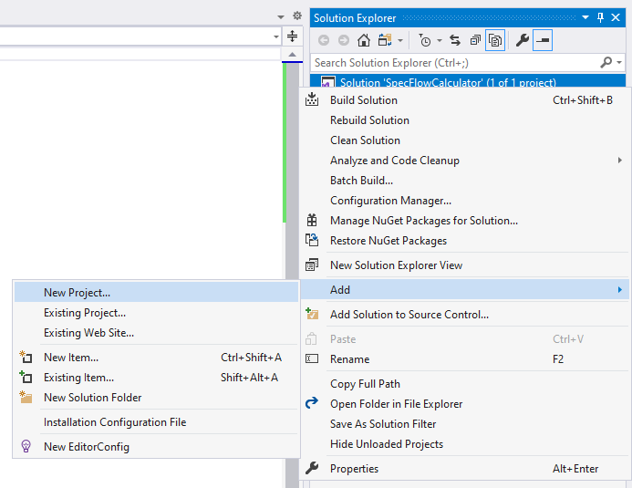
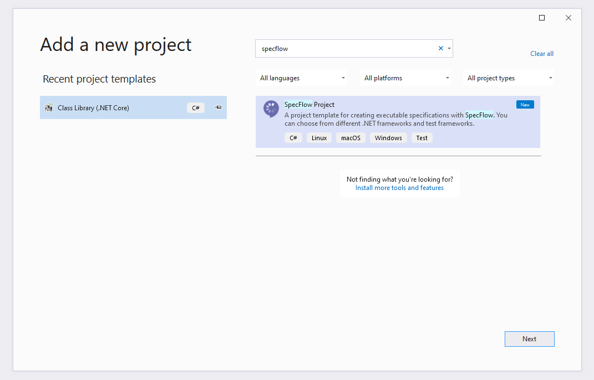
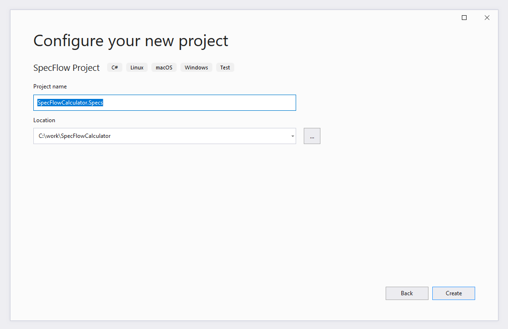
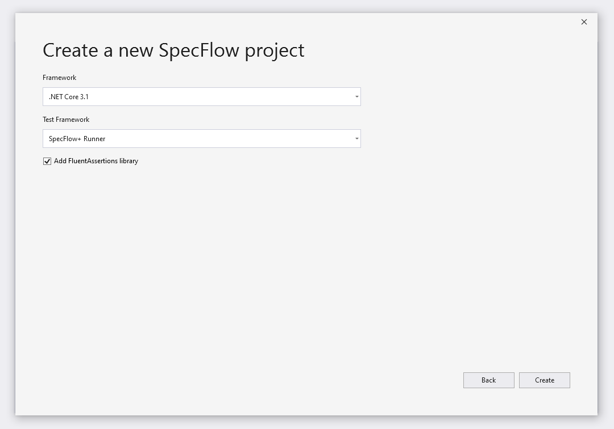
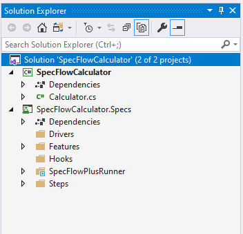
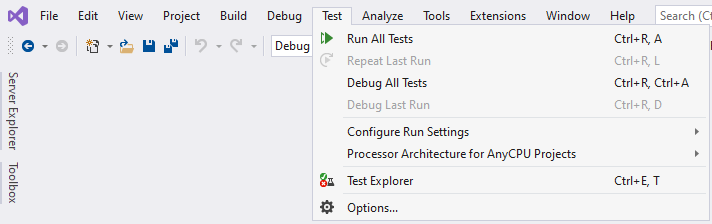
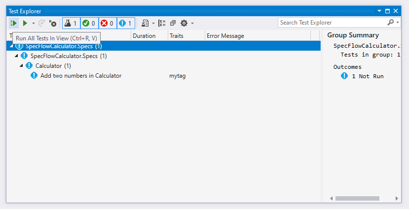
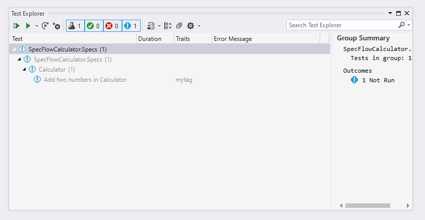
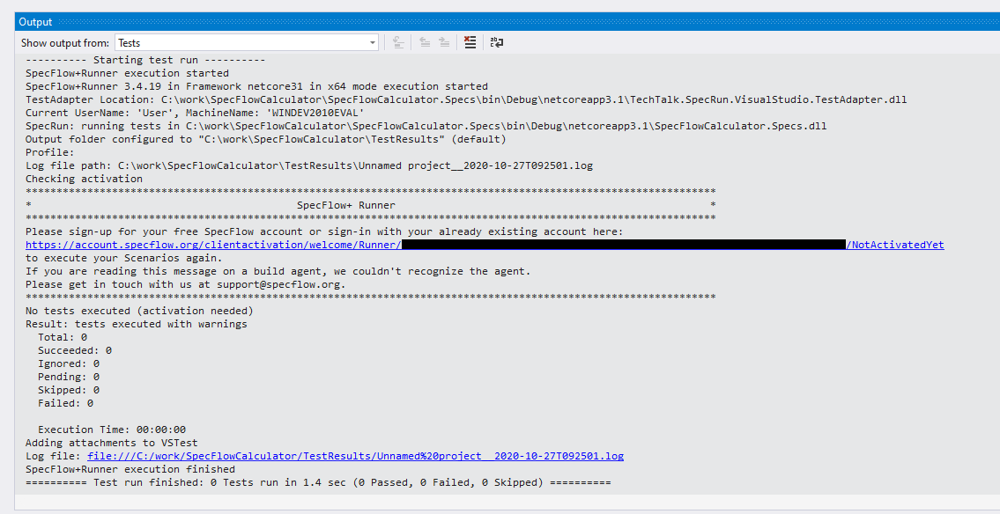

Create SpecFlow Project
=======================

⏲️ 10 minutes

In this step you'll create the SpecFlow project in the solution using Visual Studio.

Right-click the solution item "Solution 'SpecFlowCalculator' (1 of 1 project)" in the Solution Explorer and select the "Add -> New Project..." menu item.  

Search for "SpecFlow", select the "SpecFlow Project" template and click "Next".  
  

Enter the project name "SpecFlowCalculator.Specs". You can keep the suggested location (the solution folder) and click "Create".  
  

On the next screen you can configure some further details for the SpecFlow project, but you can leave everything on default now. Click "Create".  
  

Visual Studio creates the new SpecFlow project and starts to resolve the NuGet packages in the background.
You should see the new SpecFlow project in the Solution Explorer.  

Build the solution. The build should succeed.

Open the test explorer dialog from the menu "Tests -> Test Explorer".  

You should see a test already added to the SpecFlow project.  

Run the tests using the "Run All Tests in View" icon.  

Open the Output pane of Visual Studio (you can open it in the menu "View -> Output" if not already open). Select the "Tests" view in the "Show output from" drop-down.
You should see the text output of the Runner providing you a link for the activation.  

> 🛈 Note: In this step-by-step guide we use the SpecFlow+Runner as test execution framework that needs an initial activation to run the tests. If you setup your SpecFlow project with another execution framework (xUnit, NUnit, MsTest) you can skip the activation step.

In the next step you will learn about how to activate the runner on your machine.
