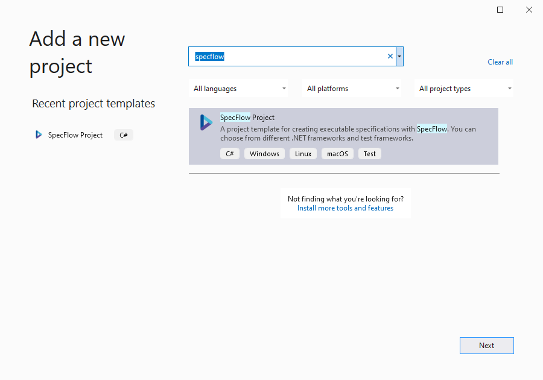

Create SpecFlow Project
=======================

⏲️ 10 minutes

In this step you'll create a SpecFlow project and add it to the existing calculator solution:

**1-** **Right-click** the solution item "Solution 'SpecFlowCalculator' (1 of 1 project)" under the Solution Explorer and select the "Add ➡ New Project..." menu item.  

**2-** Search for "SpecFlow", select the "SpecFlow Project" template and click ***Next***.  
  

**3-** Enter the project name "SpecFlowCalculator.Specs". Keep the suggested location (the solution folder) and click ***Create***.  
  

**4-** On this next screen you can configure the Test Framework (Runner) you want to use. We suggest using the free SpecFlow+ Runner but you may choose a different Runner if you a have particular preference. Hit ***Create*** once you have made your selection. 

  

**5-** Visual Studio will now create the new SpecFlow project and resolve the NuGet packages in the background.
You should see the new SpecFlow project in the Solution Explorer as per below:  

 In the next step you will learn how to add a project reference and how to use the test explorer.