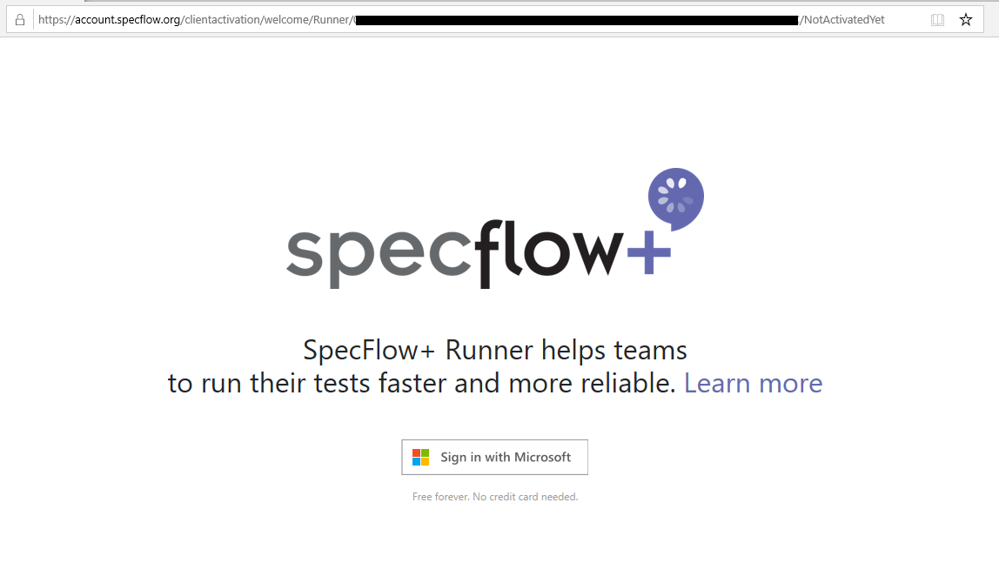
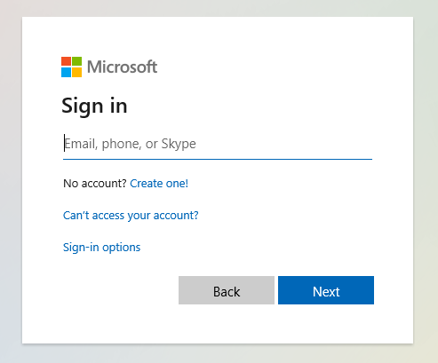
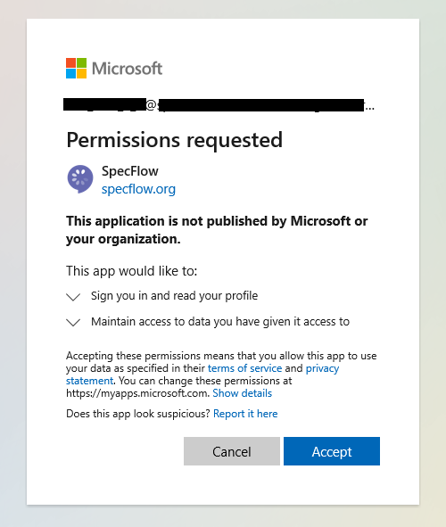
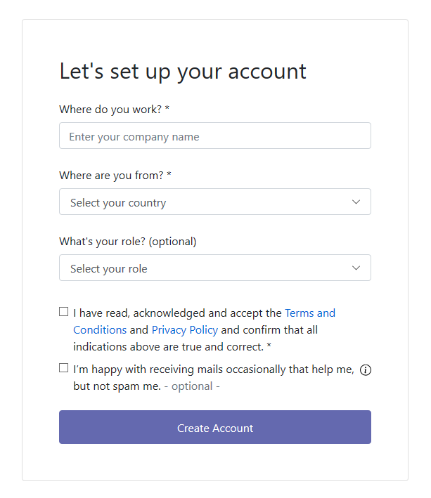
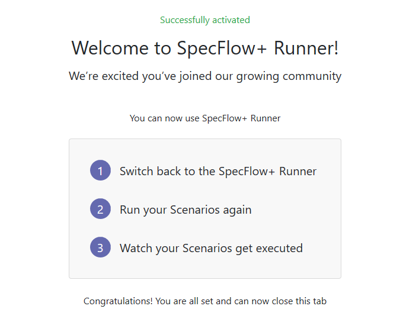
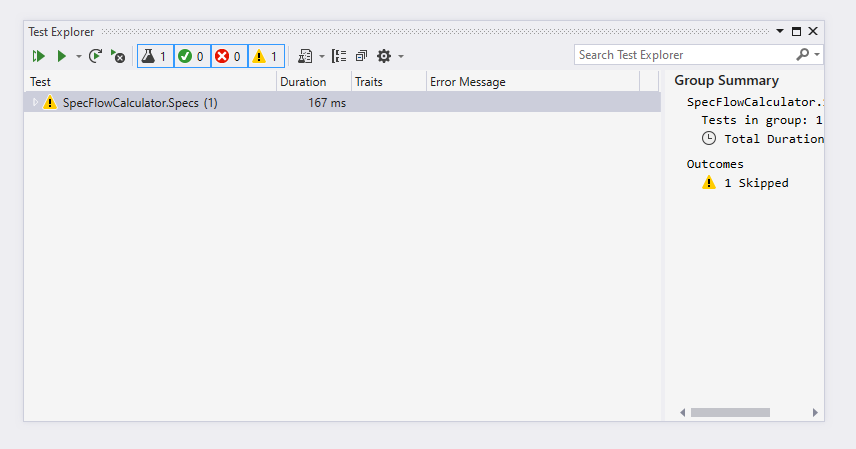

Activation
==========

⏲️ 5 minutes

In this step you'll learn how to activate your SpecFlow+Runner on your machine.

Copy the activation link from the test output and open it in your browser.  

You should see a welcome screen.  

Click the "Sign in with Microsoft" button.  

Sign in with your Microsoft account. You can use a personal or a work or school account.
If you are already signed in this should happen automatically. You might be asked to select an account if you use multiple Microsoft accounts simultaneously.

After the authentication with the selected account Microsoft asks for your permission to sign in to SpecFlow and to share your basic profile information with SpecFlow.
You have to "Accept" the permission request (consent) to continue.  
  

> 🛈 Note: If you use your work or school account, the Azure Active Directory administrator of your organization can configure the application policies, e.g. whether or not you can consent to applications on your behalf. With a restrictive Azure Active Directory configuration only the administrator (or dedicated personnel) might be able to give consent to sign in to SpecFlow from your organization. Follow the instructions on the Microsoft authentication site or contact your Azure Active Directory administrator directly. [Learn more about admin consents](https://docs.microsoft.com/en-us/azure/active-directory/manage-apps/configure-admin-consent-workflow).

After you signed in with your Microsoft account fill-in your account details and click "Create Account".  

You have successfully signed up your SpecFlow Account and your SpecFlow+ Runner is activated.  

Switch back to Visual Studio and execute the tests.  

Your test has been executed now (see the duration in milliseconds), but the test does not do much yet and shows the "Skipped" status.

In the next step you will learn how to automate your first scenario.
