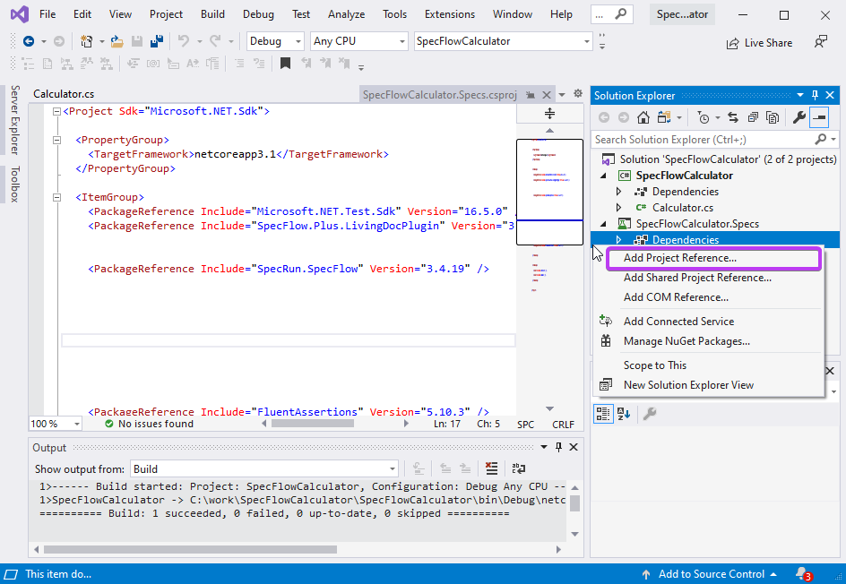
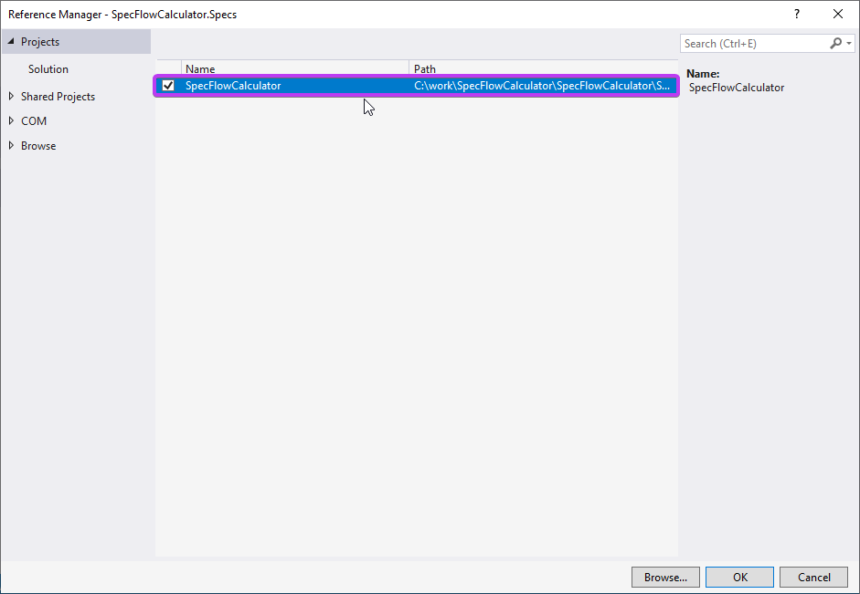
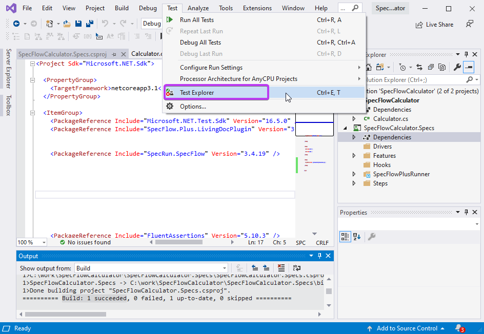
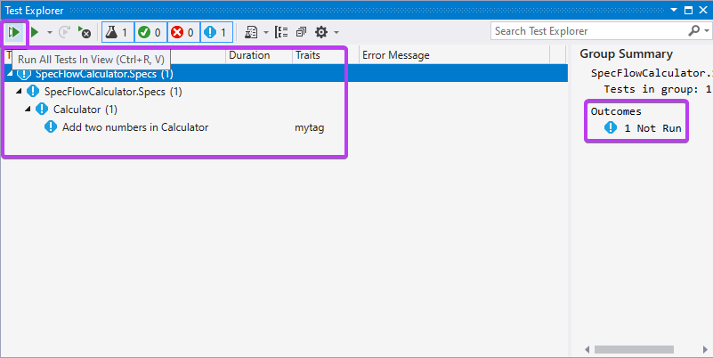

Create SpecFlow Project - Continue  
=======================

⏲️ 5 minutes

You will now add a project reference to the "SpecFlowCalculator" class library in the newly created SpecFlow project. This is necessary because we want to test the "Calculator" class implemented in the class library in the "SpecFlowCalculator.Specs" project. To do this, follow the below steps:
  
**1-** Expand the project node "SpecFlowCalculator.Specs" in the Solution Explorer, right-click the "Dependencies" node and select the "Add Project Reference..." menu item.  

**2-** In the "Reference Manager" dialog check the "SpecFlowCalculator" class library and click ***OK***.

Now the solution is set up with a class library containing the implementation of the calculator and a SpecFlow project that contains the specification and tests of the calculator.

**3-** Now build the solution. You should see the "Build : 1 succeeded" message in the output window. **Refer to page 2 step 6 of this guide if you cannot recall how to build the solution.*

**4-** Open the test explorer dialog from the menu "Tests ➡ Test Explorer".  

**5-** You should see a test already added to the SpecFlow project by the project template. Run the test using the "Run All Tests in View" icon. Note that the outcome/status of the test remains "Not Run" as the test has not executed yet.

 In the next step you will learn how to activate the SpecFlow + Runner on your machine.
