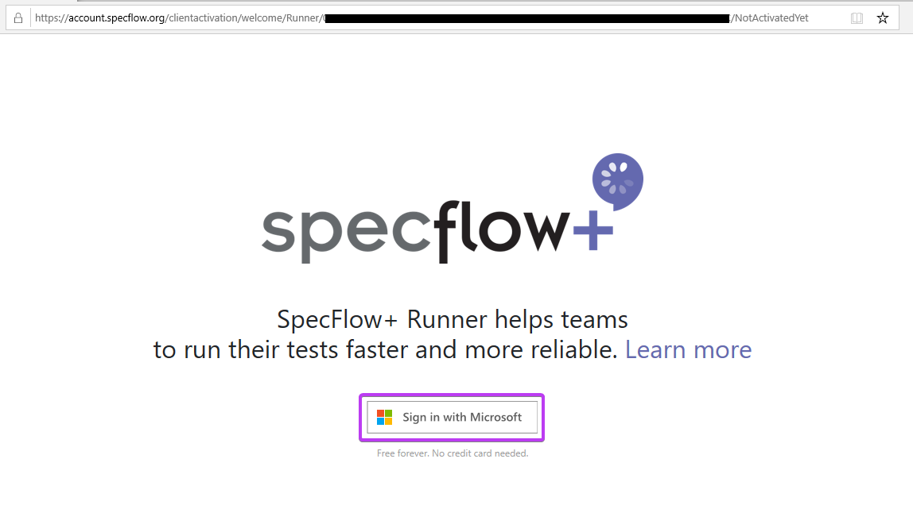
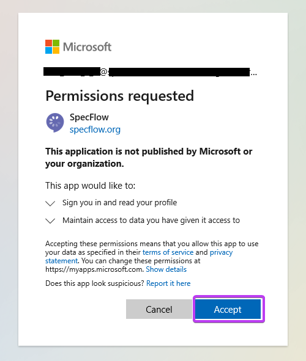
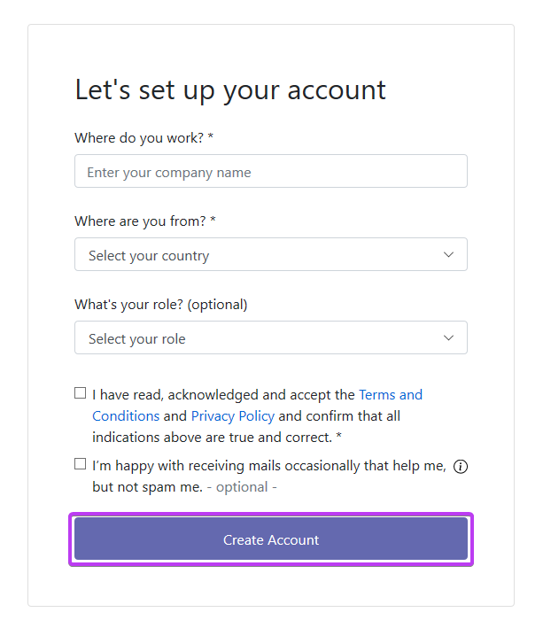

Activation
==========

⏲️ 5 minutes

In this step you'll learn how to activate your SpecFlow+Runner on your machine.

Copy the activation link from the test output and open it in your browser.  

You should see a welcome screen.  

Click the "Sign in with Microsoft" button.  

Sign in with your Microsoft account. It can be a personal or work/school account.
If you are already signed in this should happen automatically, or you might be asked to select an account if you use multiple Microsoft accounts simultaneously.

The Microsoft sign in will ask for your permission to sign in to SpecFlow and to share your basic profile information with SpecFlow (e-mail address and name.
You have to "Accept" the permission request to continue.  
  

> 🛈 Note: If you use your work/school account you might need additional permissions from your Active Directory administrator to continue. [Learn more about admin consents](https://docs.microsoft.com/en-us/azure/active-directory/manage-apps/configure-admin-consent-workflow).

After you signed in with your Microsoft account fill-in your account details and click "Create Account".  

You have successfully signed up your SpecFlow Account and your SpecFlow+ Runner is activated.  

Switch back to Visual Studio and execute the tests.  

Your test has been executed now (see the duration in milliseconds), but the test does not do much yet and shows the "Skipped" status.

In the next step you will learn how to automate your first scenario.
