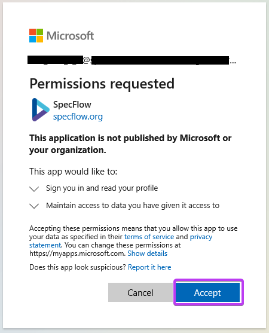

SpecFlow + Runner activation
=============================

⏲️ 5 minutes

***You may skip this step if you picked a different runner than SpecFlow + Runner during the project setup (Step 3)**.

In this step you'll learn how to activate the SpecFlow+Runner on your machine.

<iframe width="560" height="315" src="https://www.youtube.com/embed/LHdIAMG8D9U" frameborder="0" allow="accelerometer; autoplay; clipboard-write; encrypted-media; gyroscope; picture-in-picture" allowfullscreen></iframe>

**1-** Open the Output pane of Visual Studio (you can open it in the menu "View ➡ Output" (if not already open). Select the "Tests" view in the "Show output from" drop-down.
You should see the test output of the SpecFlow+ Runner including a link for the activation.

**You will see this link only if you picked SpecFlow+ Runner as your preferred test Runner during the project setup.*

**2-** Copy the activation link from the test output and open it in your browser.  

**3-** You should now see a welcome screen, click the ***Sign in with Microsoft*** button. Preferably, use your work or student Microsoft account to sign in, but if your professional account is restricted and you run into issues you can always use your personal Microsoft account.

**4-** After the authentication with the selected account, Microsoft will ask for your permission to sign in to SpecFlow and share your basic profile information with SpecFlow.
You have to "Accept" the permission request to continue.  
  

**5-** After you signed in with your Microsoft account fill-in the required account details and click ***Create Account***.  

**6-** You will then see the below screen showing a successful activation of your SpecFlow account. Your SpecFlow+ Runner is now activated and ready to use.

*> **Note**: Please note that an actiavation is needed for each user/machine.*

**7-** Switch back to Visual Studio and re-execute the tests. The test has been executed now (see the duration in milliseconds), but the test does not do much yet and shows the "Skipped" status.  

📄 In the next step you will learn how to automate your first scenario.