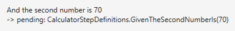

Bind first step
===============

⏲️ 10 minutes

In this step you'll bind your first step (automate your first scenario step with SpecFlow).

Open the `Calculator.feature` file by double-clicking it in the Solution Explorer (SpecFlowCalculator.Specs -> Features -> Calculator.feature)

The purpose of this feature file is to document the expected behavior of your calculator in a way that it is both human-readable and suitable for test automation. SpecFlow uses the Gherkin language where you can phrase the scenarios using _Given/When/Then_ steps. Currently there is a single scenario (automatically added by the SpecFlow project template) that describes how adding two numbers should work with the calculator.

``` Gherkin
Scenario: Add two numbers
    Given the first number is 50
    And the second number is 70
    Then the two numbers are added
    Then the result should be 120
```

Based on the scenario text SpecFlow generates an automated test that executes the scenario. However, it is not yet defined what the steps of the scenario should "do".

Right-click the fist _Given_ step "Given the first number is 50" and select either the "Go To Definition" or the "Go To Step Definition" command.  


Visual Studio locates the step definition (binding) that belongs to the step. In the current case it opens the `CalculatorStepDefinitions` class.  


And it jumps to the `GivenTheFirstNumberIs` method.  


> Note: the step definition is located based on the  `[Binding]` attribute on the class and the `[Given]` attribute on the method. The regular expression of the _Given_ attribute matches the text of the scenario step.

Add a field to the class to instantiate a calculator that we want to test (SUT).

``` c#
        private readonly Calculator _calculator = new Calculator();
```

Replace the implementation of the step definition method with the code that sets the first number of the calculator (as the step suggests).

``` c#
        [Given("the first number is (.*)")]
        public void GivenTheFirstNumberIs(int number)
        {
            _calculator.FirstNumber = number;
        }
```

Execute the test in the Test Explorer and click "Open additional output for this result" in the right pane.  


In the detailed output you can see that the first step "Given the first number is 50" has been matched to the step definition method "CalculatorStepDefinitions.GivenTheFirstNumberIs" as expected, and it has been called with the argument 50. The done status means that the step executed successfully (no errors).  


The next step in the scenario is pending, because we did not implement it yet.  


In the next step you will bind the rest of the scenario steps to conclude the automation of the first scenario.
