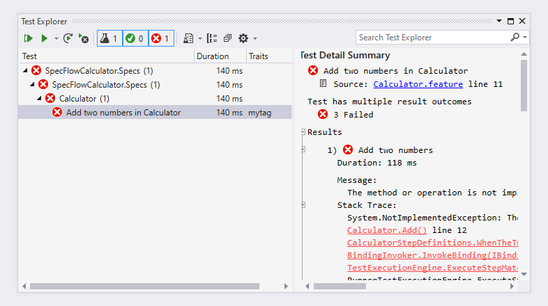
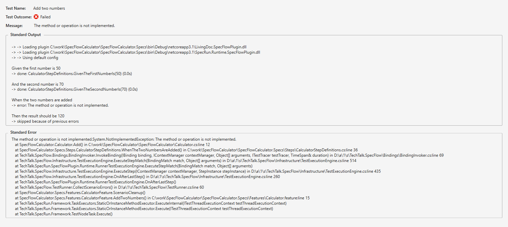

Bind remaining steps
====================

⏲️ 10 minutes

In this step you'll bind the remaining 3 steps of the first scenario. In the previous step you have created the binding for the first step already.

``` Gherkin
Scenario: Add two numbers
    Given the first number is 50
    And the second number is 70
    When the two numbers are added
    Then the result should be 120
```

Like in the previous step, you can navigate to the bindings from the feature file, or you can open the `CalculatorStepDefinitions.cs` directly.

Implement the binding of the second step "And the second number is 70" by replacing the code of the `GivenTheSecondNumberIs` method. The implementation is very similar to the first binding, but you have to set the second number of the calculator.

``` c#
    [Given("the second number is (.*)")]
    public void GivenTheSecondNumberIs(int number)
    {
        _calculator.SecondNumber = number;
    }
```

> Note: we use the "And" keyword in the Gherkin scenario for better readability. The "And" keyword will be interpreted as "Given", "When" or "Then" depending on the previous step(s) in the scenario. In our case the "And the second number is 70" is interpreted as a "Given" step, because the previous step is a "Given" step.

Implement the binding of the third step "When the two numbers are added" by replacing the code of the `WhenTheTwoNumbersAreAdded` method. Note that the method must have a `When` attribute, because it belongs to a "When" step in the scenario.
The implementation calls the `Add` method of the calculator. Note that the result of the addition is not stored by the calculator in a property/field but it is returned  to the caller. It's a good idea to store the returned value in a field so that we can work with the result afterwards.

``` c#
    private int _result;

    [When("the two numbers are added")]
    public void WhenTheTwoNumbersAreAdded()
    {
        _result = _calculator.Add();
    }
```

Implement the binding of the last step "Then the result should be 120" by replacing the code of the `ThenTheResultShouldBe` method. Note that the method must have a `Then` attribute, because it belongs to a "Then" step in the scenario.
Add a namespace using for FluentAssertions at the top of the file:

``` c#
using FluentAssertions;
```

The implementation validates if the result of the addition matches the expected value (using the FluentAssertions library).

``` c#
    [Then("the result should be (.*)")]
    public void ThenTheResultShouldBe(int result)
    {
        _result.Should().Be(result);
    }
```

After implementing all step definitions and cleaning up the file you should have the following code:

``` c#
using FluentAssertions;
using TechTalk.SpecFlow;

namespace SpecFlowCalculator.Specs.Steps
{
    [Binding]
    public sealed class CalculatorStepDefinitions
    {
        // For additional details on SpecFlow step definitions see https://go.specflow.org/doc-stepdef

        private readonly ScenarioContext _scenarioContext;

        private readonly Calculator _calculator = new Calculator();
        private int _result;

        public CalculatorStepDefinitions(ScenarioContext scenarioContext)
        {
            _scenarioContext = scenarioContext;
        }

        [Given("the first number is (.*)")]
        public void GivenTheFirstNumberIs(int number)
        {
            _calculator.FirstNumber = number;
        }

        [Given("the second number is (.*)")]
        public void GivenTheSecondNumberIs(int number)
        {
            _calculator.SecondNumber = number;
        }

        [When("the two numbers are added")]
        public void WhenTheTwoNumbersAreAdded()
        {
            _result = _calculator.Add();
        }

        [Then("the result should be (.*)")]
        public void ThenTheResultShouldBe(int result)
        {
            _result.Should().Be(result);
        }
    }
}

```

Build the solution. The build should succeed.

Run the test.

The test should execute and fail. In the Test Detail Summary pane of Test Explorer you can see that a NotImplementedException has been thrown in the Add method of the calculator.  


Click on the "Open additional output for this result" below the stack trace to see a more detailed log of the scenario.  


You can see that the first two "Given" steps executed successfully and the "When the two numbers are added" step failed with an error. This is because the addition method of the calculator is not implemented yet.

In the next step you'll fix the implementation of the calculator to turn the scenario green.
