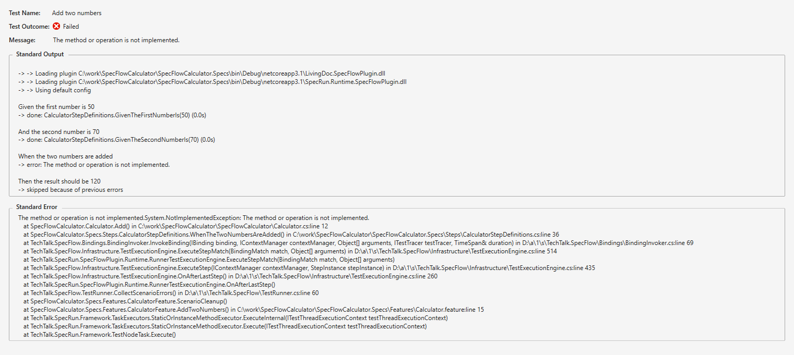

Fix implementation
==================

⏲️ 3 minutes

In this step you'll fix the implementation of the calculator to turn the scenario green.

Open `Calculator.cs` in the `SpecFlowCalculator` class library and replace the implementation of the `Add` method.

``` c#
    public int Add()
    {
        return FirstNumber + SecondNumber;
    }
```

Build the solution. The build should succeed.

Run the test.

The test should execute and succeed.  


Click on the "Open additional output for this result" to see a more detailed log of the scenario.  


You can see that the each steps executed successfully and hence the test is green.

In the next step it is your turn to add a new feature to the calculator.
