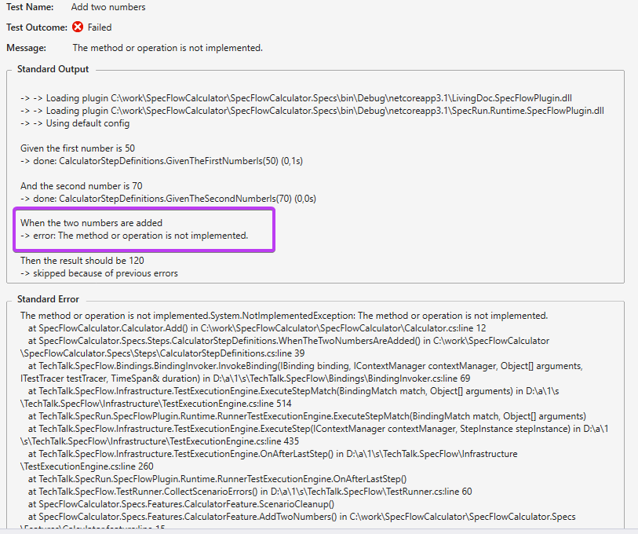

Fix implementation
==================

⏲️ 3 minutes

In this step you'll fix the implementation error of the calculator in the previous page.

**1-** Open `Calculator.cs` in the `SpecFlowCalculator` class library and replace the implementation of the `Add` method with the below code:

``` c#
    public int Add()
    {
        return FirstNumber + SecondNumber;
    }
```


**2-** Build the solution. The build should succeed.

**3-** Run the test.The test should now execute and succeed with the green tick marks indicating no errors:


**4-** Click on the "Open additional output for this result" to see a more detailed log of the scenario:  


You can see that the each step executed successfully and the test is passed.

 In the next step you'll learn how to generate a living documentation.
