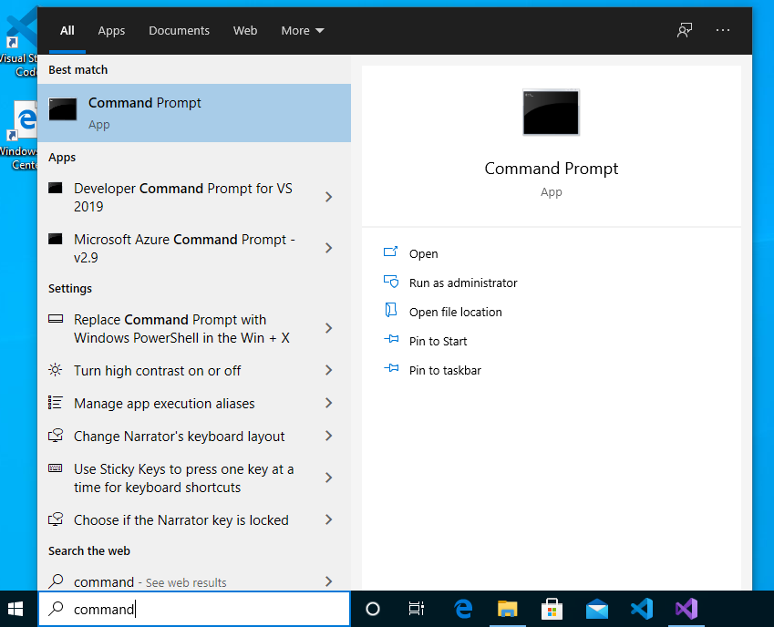
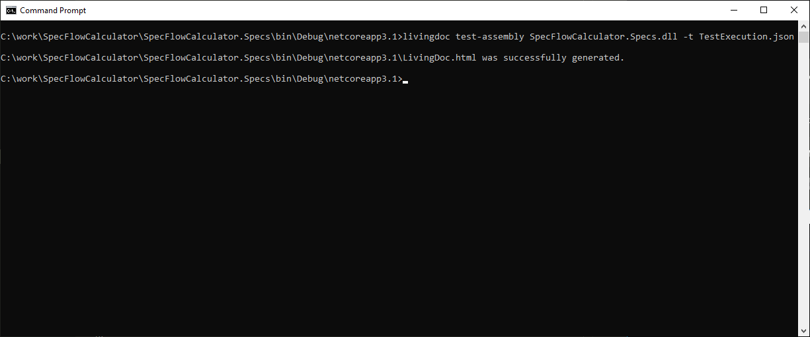
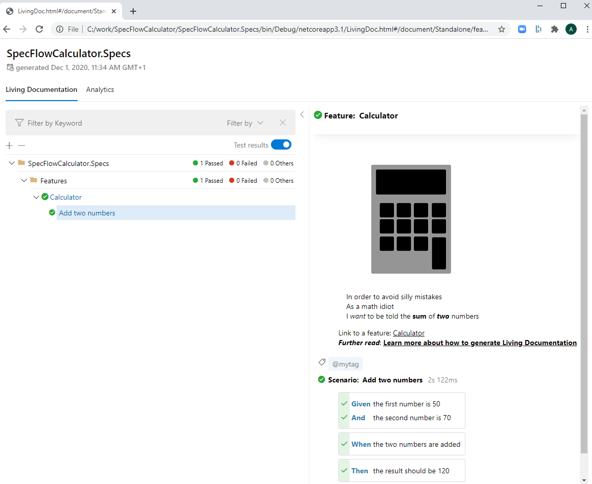
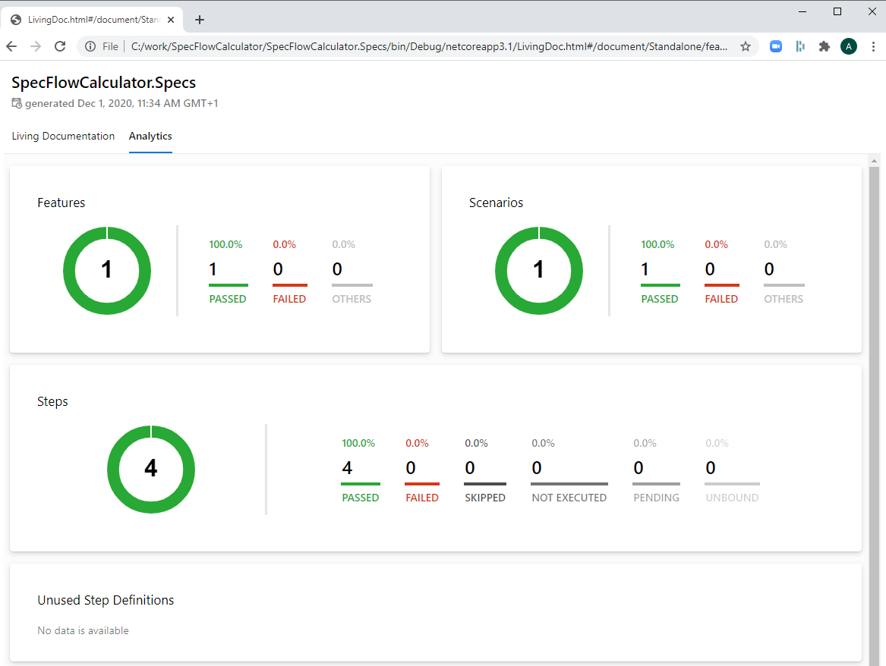

Add Living Documentation
========================

⏲️ 5 minutes

In this step you'll learn how to generate a living documentation from your test execution results so you can easily share them with your team.

*> **Note:** If you have skipped the previous steps make sure your project tests have been executed before continuing with this step.*

<iframe width="560" height="315" src="https://www.youtube.com/embed/eX8JCtZKPfk" frameborder="0" allow="accelerometer; autoplay; clipboard-write; encrypted-media; gyroscope; picture-in-picture" allowfullscreen></iframe>

**1-** Open a command prompt.  



**2-** Install the LivingDoc CLI as a global dotnet tool.

``` batch
dotnet tool install --global SpecFlow.Plus.LivingDoc.CLI
```


**3-** Navigate to the **output directory of the SpecFlow project**. In this example the solution was setup in the `C:\work` folder.

``` batch
cd C:\work\SpecFlowCalculator\SpecFlowCalculator.Specs\bin\Debug\netcoreapp3.1
```

**4-** Run the LivingDoc CLI by using the below command to generate the HTML report.

``` batch
livingdoc test-assembly SpecFlowCalculator.Specs.dll -t TestExecution.json
```



**5-** Open the generated HTML with your favorite browser. The HTML file is stored in the same folder as the **output directory of the SpecFlow project**.

``` batch
C:\work\SpecFlowCalculator\SpecFlowCalculator.Specs\bin\Debug\netcoreapp3.1\LivingDoc.html
```

**Note: if you run into issues here, e.g your JSON file name is FeatureData.JSON instead of TestExecution.JSON, this indicates you have an older version of the CLI tool. Please check our [migration guide here](https://docs.specflow.org/projects/specflow-livingdoc/en/latest/Guides/Generator-Migration-v3.4-v3.5.html) to upgrade to the latest version.*

Review the living documentation of the calculator features that you have implemented. Select the "Calculator" feature in the tree. On the right pane check the detailed description of the feature and the scenarios. You can also see the "green" test execution result of the scenarios and steps.



Check the test result summary by clicking on the "Analytics" tab:



SpecFlow+LivingDoc is packed with great features that truly bring your documentation to life!

📄 To read more about SpecFlow+LivingDoc and its features, please visit our dedicated [LivingDoc documentation page](https://docs.specflow.org/projects/specflow-livingdoc/en/latest/index.html).