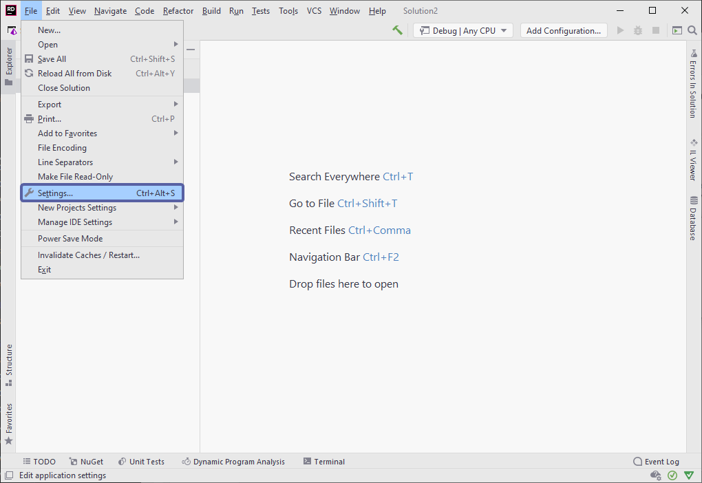
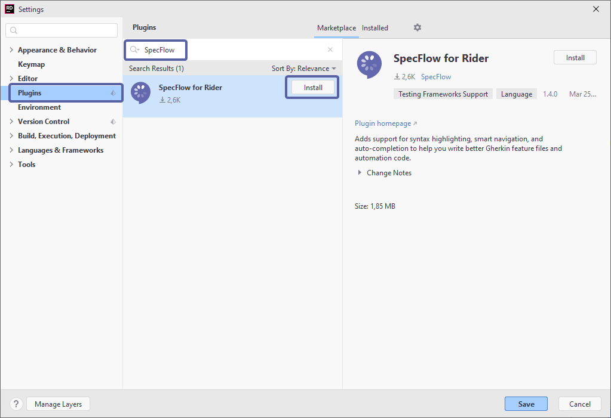
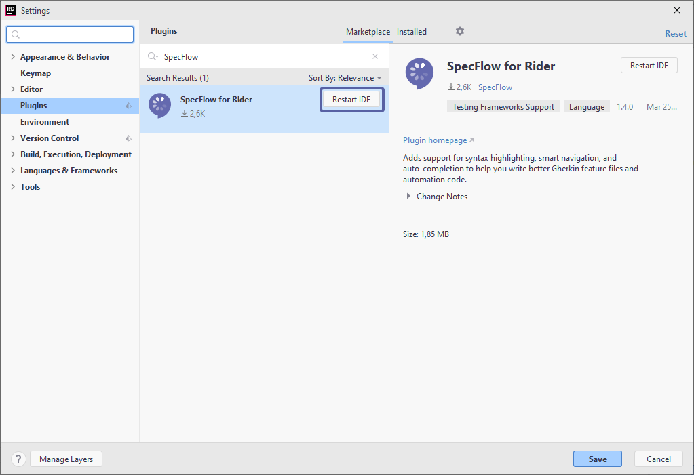

Install JetBrains Rider Plugin
===============================
⏲️ 10 minutes

In this step you'll learn how to install the SpecFlow for Rider plugin. SpecFlow's JetBrains Rider plugin not only enables the functionalities needed for testing automation, but is also bundled with several helpful <a href="https://docs.specflow.org/projects/specflow/en/latest/Rider/rider-features.html" target="_blank" rel="noopener noreferrer">features</a> to make the journey more intuitive.

The plugin can be found either at the [JetBrains marketplace](https://plugins.jetbrains.com/plugin/15957-specflow-support) or directly from within the Rider IDE.

To install the plugin directly from JetBrains Rider:

**1-** Open JetBrains Rider

**2-** Navigate to ***File ➡ Settings ➡ Plugins (Ctrl+Alt+S)*** and search for “SpecFlow” in the search bar:

**3-** Hit ***Install*** and then ***Accept*** when prompted with the privacy note. You can find our privacy policy [here](https://specflow.org/privacy-policy/)

**4-** You are then required to restart the Rider IDE, hit ***Restart***:

📄 The installation is now finished. In the next step you’ll create a simple application that will be used throughout this guide.
