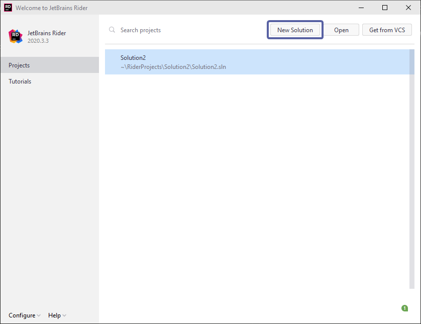
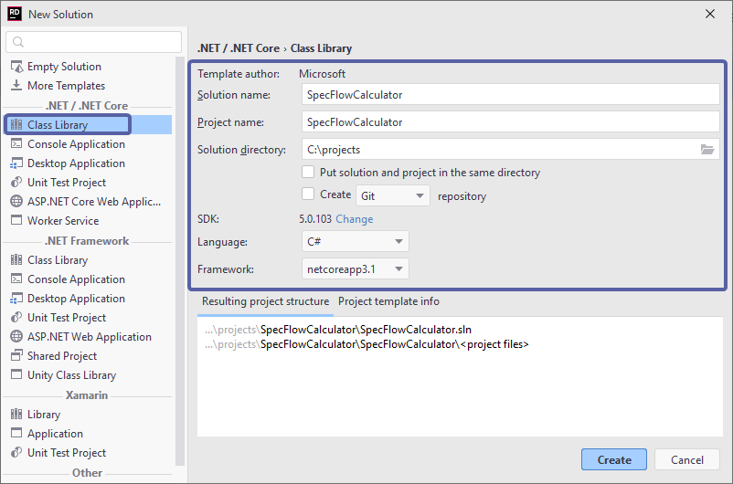
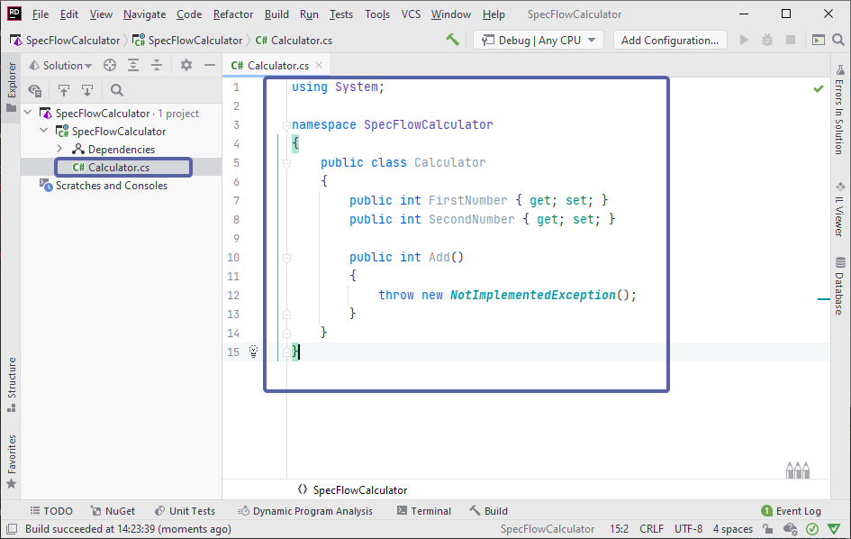
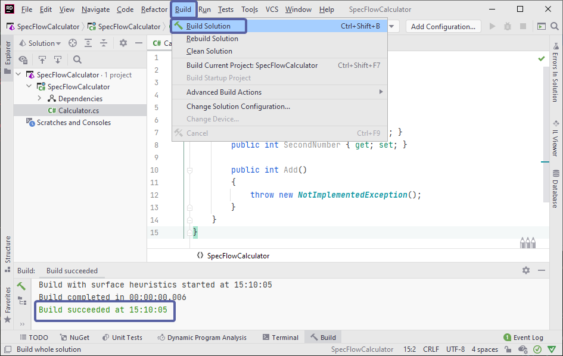

Create calculator project
=========================

⏲️ 10 minutes

In this step you'll create the application that will be tested, also called System Under Test (SUT).
The application will be a simple calculator in a C# class library.

**1-** Open JetBrains Rider and create a new C# class library by selecting "New Solution" from the startup dialog:



**2-** Select "Class library" and use the below configurations and click ***Create***.

- Solution & Project name: SpecFlowCalculator

- Solution directory: **choose a location to save the project* - in this example the solution is saved to `C:\projects`

- Language: C#

- Framework: netcoreapp3.1
  


**3-** Rename `Class1.cs` to `Calculator.cs` and overwrite the content with the following code :

``` csharp
using System;

namespace SpecFlowCalculator
{
    public class Calculator
    {
        public int FirstNumber { get; set; }
        public int SecondNumber { get; set; }

        public int Add()
        {
            throw new NotImplementedException();
        }
    }
}

```



**4-** Now build the solution by navigating to "Build ➡ Build Solution". You should see a "Build Succeeded" message in the output window:



📄 The calculator application is now built. In the next step you'll learn how to create a SpecFlow project.
