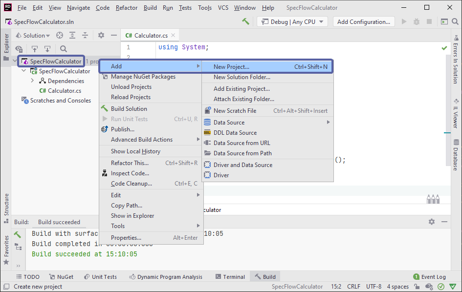
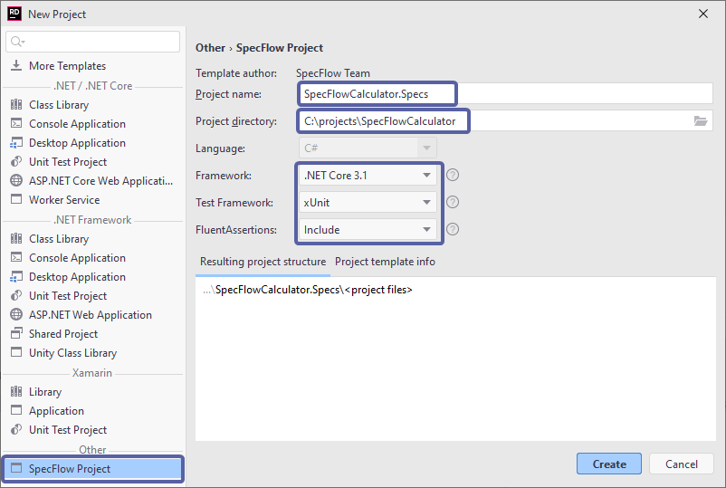
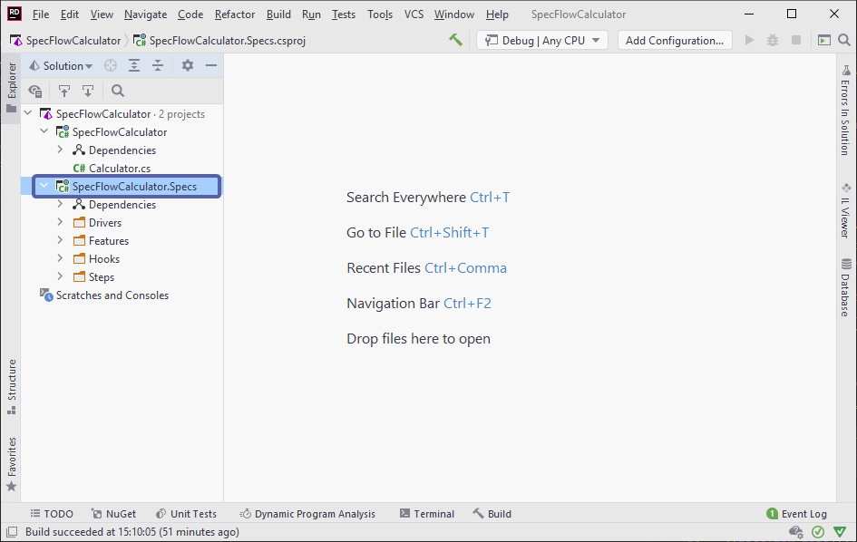

Create SpecFlow project
=======================

⏲️ 5 minutes

In this step you'll create a SpecFlow project and add it to the existing calculator solution.

**1-** **Right-click** the solution item *"'SpecFlowCalculator'(1 of 1 project)"* under the Solution Explorer and select the "Add ➡ New Project" menu item.

**2-** Click on *SpecFlow Project Template* under the *Other* category, enter the project name as **"SpecFlowCalculator.Specs"**, keep the suggested location (the solution folder), pick *xUnit* as the Test Framework and hit *Create*:

> Note: If you cannot see SpecFlow Project Template, close this window, run `dotnet new -i SpecFlow.Templates.DotNet` in a command window, and go back to step 1.

> Note: Currently running the tests from the feature files is only possible with **xUnit** and **NUnit**.*

**3-** JetBrains Rider will now create the new project, you should see the new SpecFlow project in the Solution Explorer as per below:

📄 In the next step you will learn how to add a project reference and how to use the test explorer.
