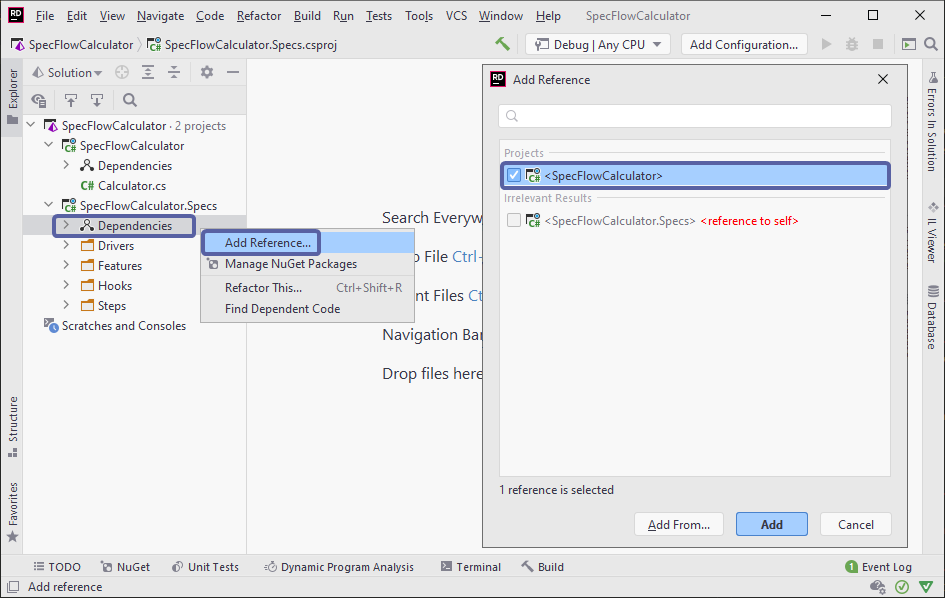
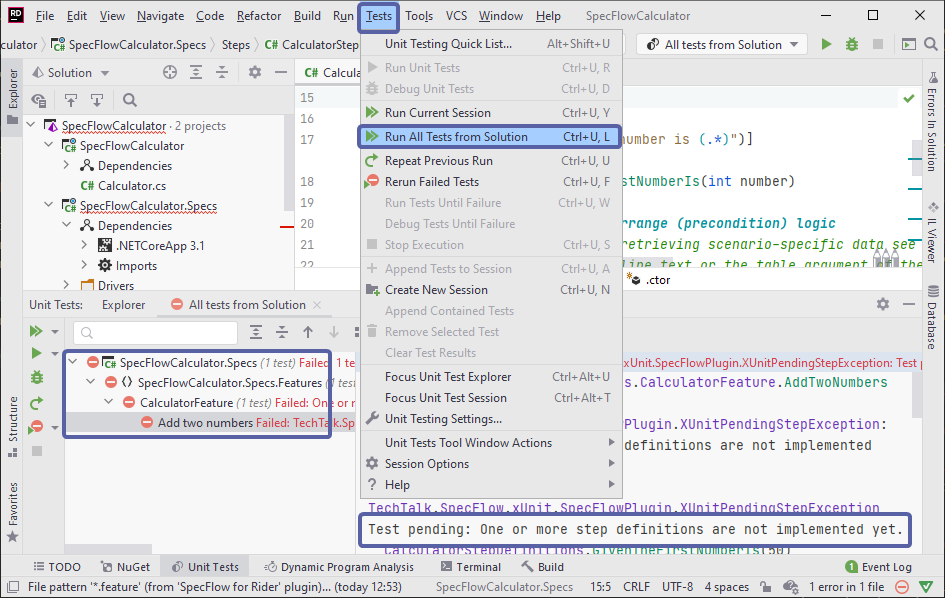

Create SpecFlow project - Continue  
=======================

⏲️ 5 minutes

You will now add a project reference to the "SpecFlowCalculator" class library in the newly created SpecFlow project. This is necessary because we want to test the "Calculator" class implemented in the class library in the "SpecFlowCalculator.Specs" project. To do this, follow the below steps:

**1-** Expand the project node *"SpecFlowCalculator.Specs"* in the Solution Explorer, right-click the *"Dependencies"* node and select the *"Add Reference..."* menu item.

**2-** In the "Add Reference" dialog check the "SpecFlowCalculator" class library and click ***Add***.

Now the solution is set up with a class library containing the implementation of the calculator and a SpecFlow project that contains the specification and tests of the calculator.

**3-** Now build the solution. You should see the "Build Succeeded" message in the output window.

**4-** Run all the tests by navigating to  "Tests ➡ Run All Tests from Solution":

The tests would fail as expected as our step definitions are not yet implemented.

📄 In the next step you will learn how to automate your first scenario and implement the step definitions.
