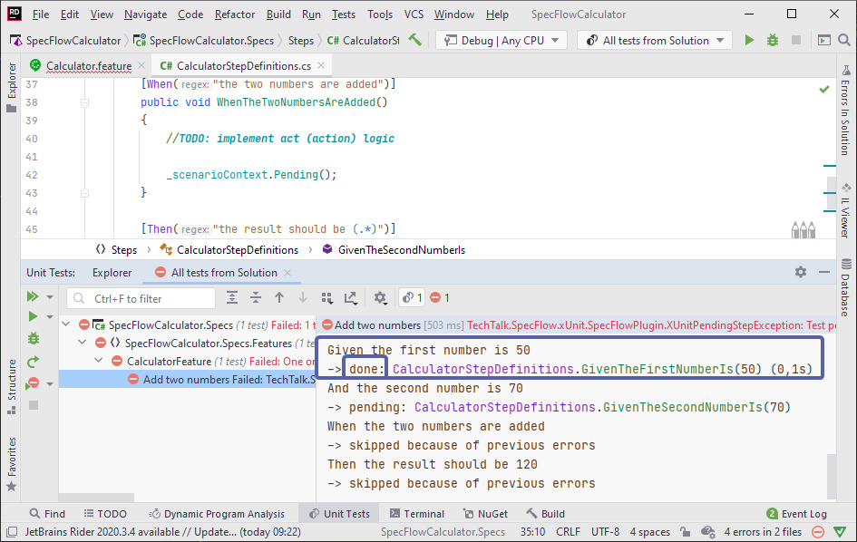

Bind the first step
===============

⏲️ 10 minutes

In this step you'll bind your first step (automate your first scenario step with SpecFlow).

**1-** Open the `Calculator.feature` file by double-clicking it in the Solution Explorer (SpecFlowCalculator.Specs ➡ Features ➡ Calculator.feature)


The purpose of this feature file is to document the expected behavior of the calculator in a way that it is both human-readable and suitable for test automation. SpecFlow uses the Gherkin language where you can phrase the scenarios using _Given/When/Then_ steps. Currently there is a single scenario (automatically added by the SpecFlow project template) that describes how adding two numbers should work with the calculator.

Here is a closer look at the Gherkin scenario used in this template:

``` gherkin

Scenario: Add two numbers
    Given the first number is 50
    And the second number is 70
    When the two numbers are added
    Then the result should be 120

```

Based on the scenario text, SpecFlow generates an automated test that executes the scenario. However, it is **not yet defined** what the steps of the scenario should actually **"do"**.

**2-** Right-click the first _Given_ step "Given the first number is 50" and select *"Go To --> Implementation"* or use the *"Ctrl + F12"* shortcut.


The SpecFlow plugin locates the step definition (binding) that belongs to this step. In this example, it opens the `CalculatorStepDefinitions` class and jumps to the `GivenTheFirstNumberIs` method.


**The step definition is located based on the  `[Binding]` attribute on the class and the `[Given]` attribute on the method. The regular expression of the _Given_ attribute matches the text of the scenario step.*

**3-** Add the below field to the class to instantiate the calculator that we want to test and created in [Step 2](../gettingstartedrider/Step2r.md) of this guide (SUT).

``` c#
        private readonly Calculator _calculator = new Calculator();
```

**4-** Replace the implementation of the first step definition method with the below code which sets the first number of the calculator.

``` c#
        [Given("the first number is (.*)")]
        public void GivenTheFirstNumberIs(int number)
        {
            _calculator.FirstNumber = number;
        }
```


**5-** Execute the test in the Test Explorer and open the text explorer output to see the details. You can see the *"done"* status here indicating the first step "Given the first number is 50" has been matched to the step definition method as per above binding. The remaining steps are yet to be implemented and are in *"pending* and *"skipped"* status as expected.



📄 In the next step you will bind the rest of the scenario steps.
