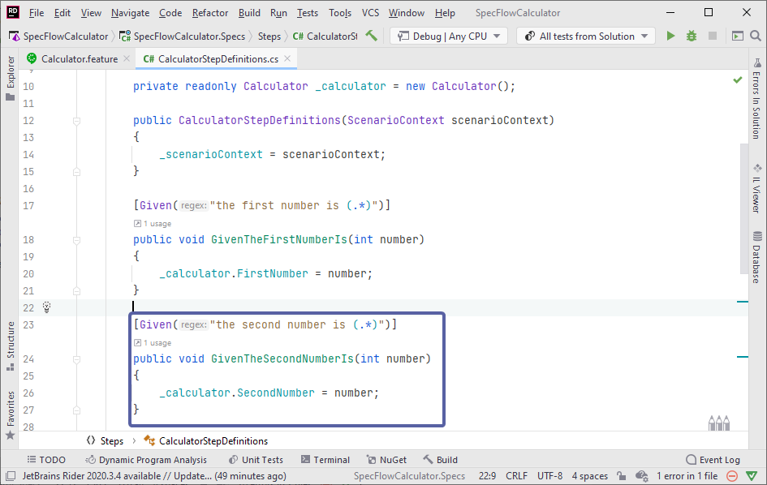
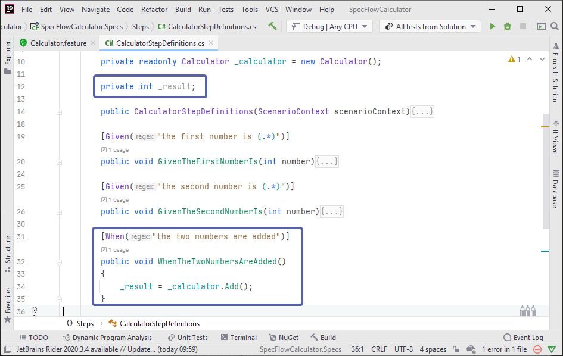
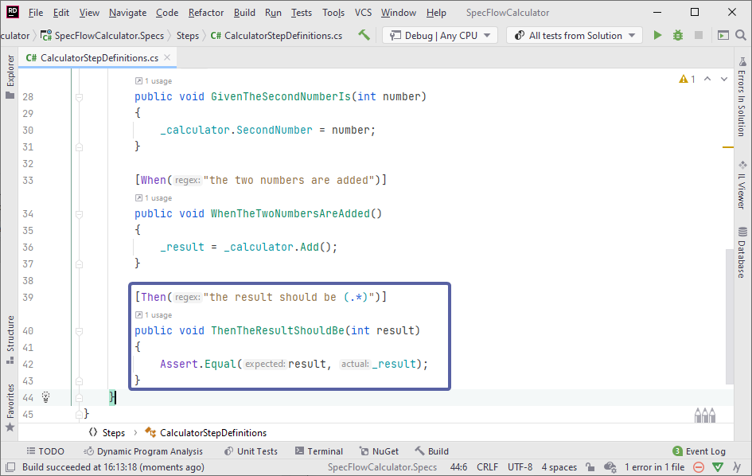
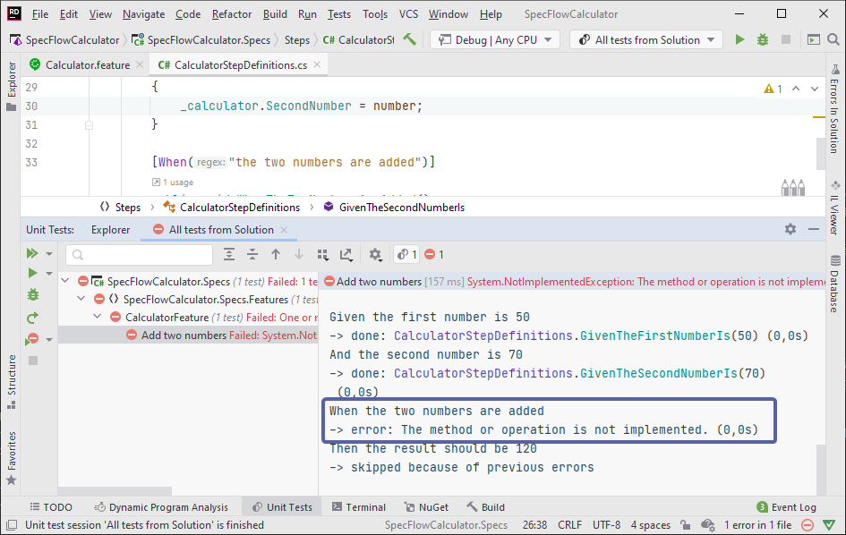

Bind remaining steps
====================

⏲️ 10 minutes

In this step you'll bind the remaining steps of the scenario.

**1-** Similar to the previous step, Right-click the second _Given_ step "And the second number is 70" and select *"Go To --> Implementation"* or use the *"Ctrl + F12"* shortcut.

**2-** Implement the binding of the second step "And the second number is 70" by replacing the code of the `GivenTheSecondNumberIs` method with the below:

``` c#
    [Given("the second number is (.*)")]
    public void GivenTheSecondNumberIs(int number)
    {
        _calculator.SecondNumber = number;
    }
```



*> Note: We use the "And" keyword in the Gherkin scenario for better readability. The "And" keyword will be interpreted as "Given", "When" or "Then" depending on the previous step(s) in the scenario. In this example the "And the second number is 70" is interpreted as a "Given" step because the previous step is a "Given" step.*

**3-** Next, implement the binding of the third step, "When the two numbers are added", by replacing the code of the `WhenTheTwoNumbersAreAdded` method with the below. The method must have a `When` attribute, as it belongs to the "When" step in the scenario.

``` csharp
    private int _result;
```

``` csharp
    [When("the two numbers are added")]
    public void WhenTheTwoNumbersAreAdded()
    {
        _result = _calculator.Add();
    }
```



This implementation calls the `Add` method of the calculator. Note that the result of the addition is not stored by the calculator in a property/field but it is returned  to the caller. It's a good idea to store the returned value in a field so that we can work with the result afterwards.

**4-** Implement the binding of the last step, "Then the result should be 120", by replacing the code of the `ThenTheResultShouldBe` method. The method must have a `Then` attribute, as it belongs to a "Then" step in the scenario.

Add a namespace using for xUnit at the top of the file:

``` csharp
    using Xunit;
```

Use the below code for implementation of the "Then" step which validates if the result of the addition matches the expected value.

``` csharp
    [Then("the result should be (.*)")]
    public void ThenTheResultShouldBe(int result)
    {
        Assert.Equal(result, _result);
    }
```



After implementing all step definitions and cleaning up the file you should have the following code:

``` csharp

using TechTalk.SpecFlow;
using Xunit;


namespace SpecFlowCalculator.Specs.Steps
{
    [Binding]
    public sealed class CalculatorStepDefinitions
    {
        private readonly ScenarioContext _scenarioContext;
        
        private readonly Calculator _calculator = new Calculator();
        
        private int _result;
        
        public CalculatorStepDefinitions(ScenarioContext scenarioContext)
        {
            _scenarioContext = scenarioContext;
        }

        [Given("the first number is (.*)")]
        public void GivenTheFirstNumberIs(int number)
        {
            _calculator.FirstNumber = number;
        }
        
        [Given("the second number is (.*)")]
        public void GivenTheSecondNumberIs(int number)
        {
            _calculator.SecondNumber = number;
        }

        [When("the two numbers are added")]
        public void WhenTheTwoNumbersAreAdded()
        {
            _result = _calculator.Add();
        }

        [Then("the result should be (.*)")]
        public void ThenTheResultShouldBe(int result)
        {
            Assert.Equal(result, _result);
        }
    }
}

```

**5-** Build the solution. The build should succeed.

**6-** Run the test again.

The test should execute and fail, this is expected. In the Test Detail Summary pane of Test Explorer you can see that the first two "Given" steps executed successfully and the "When the two numbers are added" step failed with an *error : The method or operation is not implemented*. This is because the addition method of the calculator is not implemented yet.



📄 In the next step you'll fix the implementation of the calculator to fix this error.
