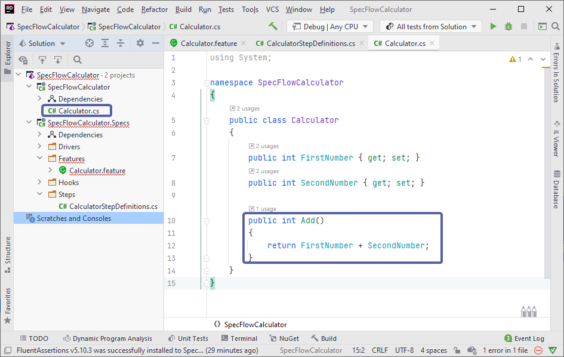
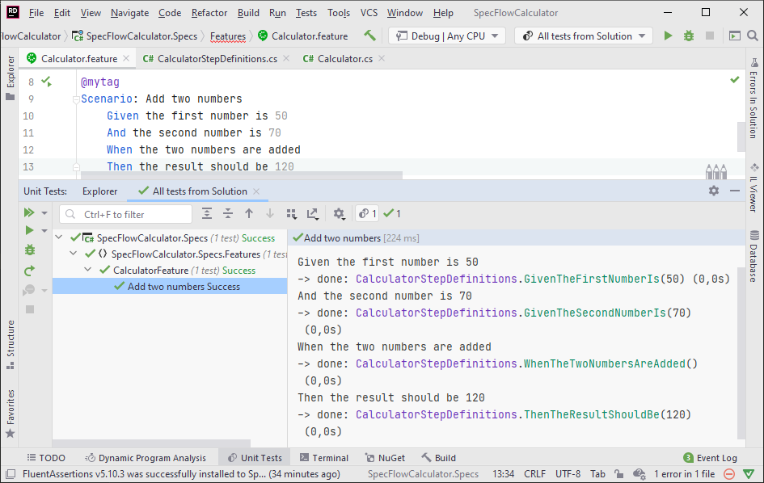

Fix implementation
==================

⏲️ 3 minutes

In this step you'll fix the implementation error of the calculator in the previous page.

**1-** Open `Calculator.cs` in the `SpecFlowCalculator` class library and replace the implementation of the `Add` method with the below code:

``` c#
    public int Add()
    {
        return FirstNumber + SecondNumber;
    }
```



**2-** Build the solution. The build should succeed.

**3-** Run the test. The test should now execute and succeed with the green tick marks indicating no errors:



📄 The automation phase is finished, in the next step you'll learn how to generate living documentation for reporting purposes.
